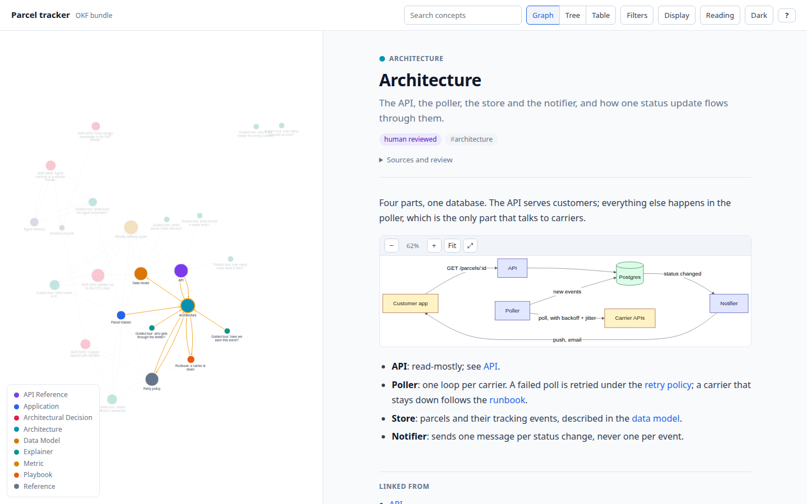
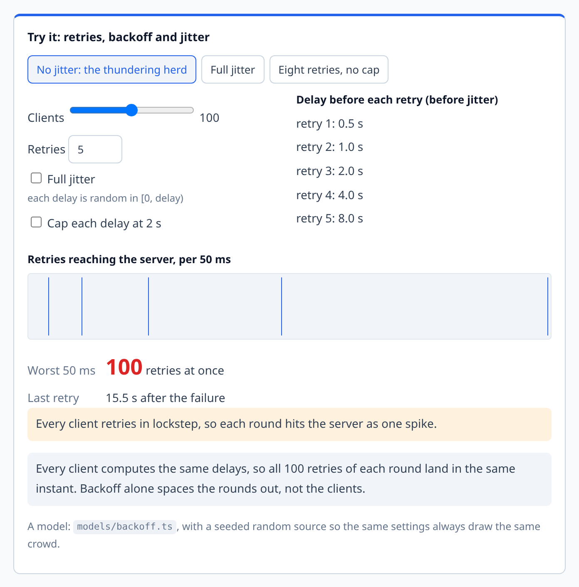
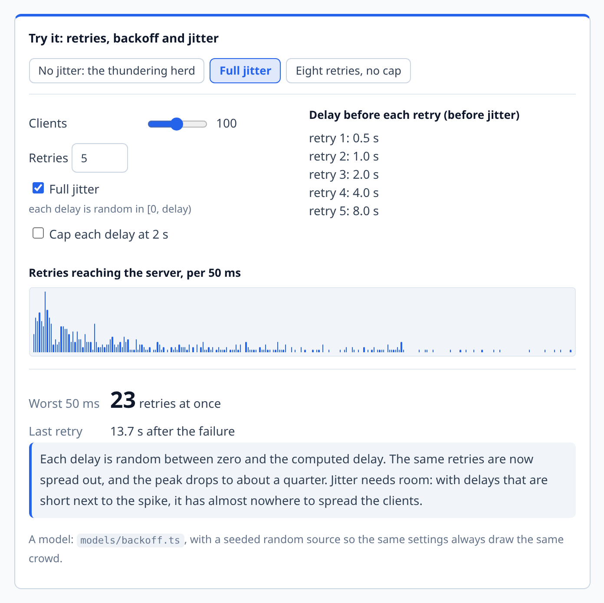
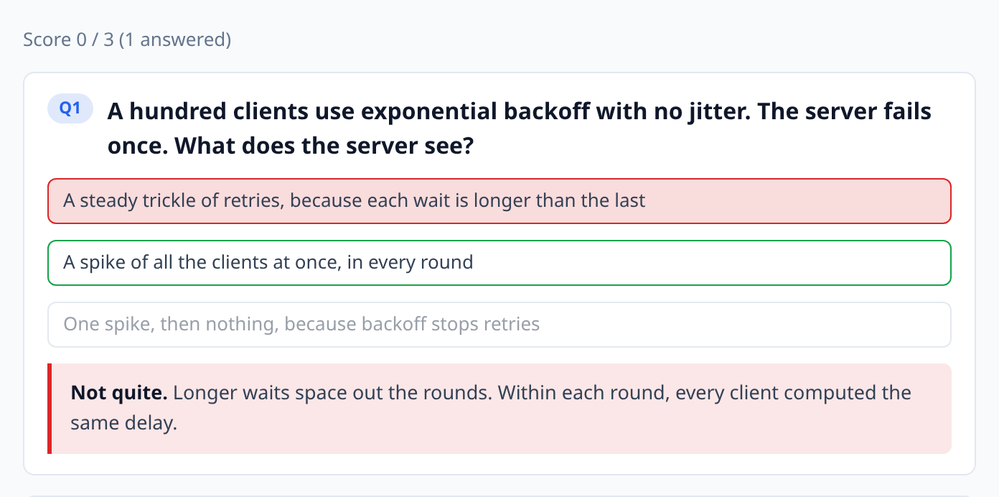

# okf-bootstrap

[](https://github.com/jb9k62/okf-bootstrap/actions/workflows/ci.yml)
[](LICENSE)


**Design docs your agents write and your team can actually follow, and a memory your agents
keep for themselves.** Agent skills for [pi](https://pi.dev) and
[Claude Code](https://claude.com/claude-code) that set up two
[OKF](https://github.com/GoogleCloudPlatform/knowledge-catalog/blob/main/okf/SPEC.md)
(Open Knowledge Format) knowledge bundles in any project. `okf/` is for people: plain markdown
next to the code, checked like code, and rendered as one self-contained page with a concept
graph, diagrams, and interactive explainers. `edukai/` (opt-in) is for the agent: short,
sourced lessons that code re-checks, handed back to the agent at the moment they matter.

<picture>
  <source media="(prefers-color-scheme: dark)" srcset="docs/images/viewer-dark.png">
  
</picture>

<sub>The viewer on the [demo bundle](examples/demo/okf): a fictional parcel-tracking service
with 22 concepts. Every internal link is an edge; the selected concept's neighbours stay lit.</sub>

## What you get

| | |
| --- | --- |
| **A doc pack** | `okf/` with an index, a dated log, decision records (ADRs) and concept folders, plus templates for concepts and guided tours |
| **A validator** | Every concept has a type, every internal link resolves, every timestamp is a real datetime; every ER diagram has its relationship key (`okf:fix` writes it); trust tiers (unverified, human-reviewed) and staleness derived from frontmatter |
| **A viewer** | One `viz.html` with no build step: searchable graph with switchable layouts, tree and table views, a neighbourhood focus, colouring by type, trust or freshness, reading pane, Mermaid diagrams with pan and zoom, light and dark themes, deep links |
| **Quality gates** | Diagrams parsed by the real Mermaid parser, then rendered in headless Chromium, with quizzes and widgets clicked; one exit-code contract (0 pass, 1 broken, 2 could not run) |
| **Interactive explainers** | Callouts, click-to-check quizzes, and React widgets that let a reader change the inputs and watch the system respond |
| **Agent memory** (opt-in) | `edukai/`: one-claim lessons pinned to the files they rest on, a re-check that finds the ones that stopped being true, and hooks for Claude Code and pi that tell the agent |

## Explainers that teach

Agents now write code faster than people can absorb it. Geoffrey Litt's
["Understanding is the new bottleneck"](https://www.geoffreylitt.com/2026/07/02/understanding-is-the-new-bottleneck.html)
argues for using the agent to build understanding too: explainer docs that go background,
intuition, details; **quizzes** as a speed regulator ("I won't send code to others until I can
pass the quiz"); and **micro-worlds** where you learn a system by living in it. This skill
makes all three first-class in the bundle.

**Widgets** are small React simulations embedded in a concept with a ` ```widget ` block. The
best ones let the reader switch off a safeguard and see what breaks. Here, a hundred clients
retry after an outage: without jitter every round lands as one spike; with it, the same
retries spread out and the peak drops to about a quarter.

<table>
  <tr>
    <td width="50%">
      <picture>
        <source media="(prefers-color-scheme: dark)" srcset="docs/images/widget-herd-dark.png">
        
      </picture>
    </td>
    <td width="50%">
      <picture>
        <source media="(prefers-color-scheme: dark)" srcset="docs/images/widget-jitter-dark.png">
        
      </picture>
    </td>
  </tr>
  <tr>
    <td align="center"><sub>No jitter: the thundering herd</sub></td>
    <td align="center"><sub>One click later: full jitter</sub></td>
  </tr>
</table>

**Quizzes** are a ` ```quiz ` block: a question, options, one marked correct, and feedback on
every option that points back at the idea. The viewer scores them as you go.

<picture>
  <source media="(prefers-color-scheme: dark)" srcset="docs/images/quiz-dark.png">
  
</picture>

````markdown
```quiz
A hundred clients use exponential backoff with no jitter. What does the server see?
- [ ] A steady trickle of retries
~ Longer waits space out the rounds. Within each round, every client computed the same delay.
- [x] A spike of all the clients at once, in every round
~ Every client started at the same instant with the same policy.
```
````

**Database schemas** get two things. Every Mermaid `erDiagram` is followed by a generated key that
reads each relationship out in words and says what `||--o{` and its relatives mean, enforced by the validator and written by `npm run
okf:fix`. A complicated schema can also carry the `sql-erd` widget: paste the `CREATE TABLE`
statements under its name and the reader gets a small and a large scenario, a design review of
what is well designed and what is not, the join path between two tables, and what deleting a row
would cascade into. Switching off the foreign keys, or editing the SQL, shows the review fail.

The three example widgets come with their models and tests, a small kit for building your own,
and a render gate that clicks every widget to prove it responds. See
[EXPLAINERS.md](skills/okf-bootstrap/references/EXPLAINERS.md) for how to write tours,
quizzes and widgets that teach.

## Agent memory

An agent starts each session knowing nothing, and what it wrote down last week may no longer
be true. `--edukai` adds a second bundle, `edukai/`, for what the agent itself has learned. Its
unit is a **lesson**: one claim, the files it rests on (pinned by a content digest), and where
the claim is text in a file, a check that code can re-run.

```yaml
confidence: tested
sources:
  - resource: src/poller/retry.ts
    digest: sha256:b0c1…
check:
  - { file: src/poller/retry.ts, contains: "RETRIES = 5" }
```

`npm run edukai:recheck` derives every lesson's state from the files: a check that no longer
holds is `failed`, a cited file that is gone is `broken`, a changed file with no check is
`suspect`. A lesson that stopped being true is superseded by a new one, never edited or
deleted. Installed as a plugin (Claude Code) or a package (pi), the hooks do three things with
no one asking: brief the agent when a session opens, name the lessons that cite a file when it
opens that file, and stop it from finishing with a lesson its own edit just broke. The `edukai`
skill covers the judgement: what is worth a lesson, and how sure to say you are.

The [memory tour](examples/demo/okf/tours/memory-explainer.md) explains the idea, and the
[demo walkthrough](examples/demo/README.md) runs it from the command line in two minutes,
with transcripts from both harnesses.

## Install

Node 24+ is required: the tools are TypeScript that Node runs directly, with no build step.

**pi**, as a package (pin a tag for reproducible installs):

```bash
pi install git:github.com/jb9k62/okf-bootstrap@v0.6.0
```

**Claude Code**, as a plugin from this repo's marketplace:

```text
/plugin marketplace add jb9k62/okf-bootstrap
/plugin install okf-bootstrap@okf-bootstrap
```

or by cloning straight into your skills directory, where it loads as a local plugin:

```bash
git clone https://github.com/jb9k62/okf-bootstrap ~/.claude/skills/okf-bootstrap
```

**Anywhere else**: clone, then link the skill into every agent you use. A `git pull` then
updates them all.

```bash
git clone https://github.com/jb9k62/okf-bootstrap && cd okf-bootstrap
npm run install-skill     # ~/.claude/skills and ~/.pi/agent/skills; --claude, --pi, --agents, --copy
```

That last way links the two skills only. The memory hooks load when the repository is installed
as a Claude Code plugin or a pi package (pi 1.0 or later); without them, the snippet `--edukai`
writes into `AGENTS.md` is what points an agent at its memory. The hooks need Node 22.18 or
later on the `PATH` they run with (on an older one they stay silent), and say nothing in a
project with no `edukai/`.

## Quick start

In the project you want documented, ask your agent:

> Bootstrap an okf for this project, with widgets and the edukai memory bundle.

> Write a guided tour of this change with a quiz, and a widget that shows how the cache
> expires.

Or invoke it directly (`/skill:okf-bootstrap` in pi, `/okf-bootstrap` in Claude Code), or run
the scaffold yourself:

```bash
node path/to/okf-bootstrap/skills/okf-bootstrap/assets/bootstrap.mts . --name "My App" --widgets --edukai
npm install
npm install -D @mermaid-js/mermaid-cli@11 playwright && npx playwright install chromium

npm run okf:validate        # types, links, timestamps: expect 0 issues
npm run okf:view            # writes okf/viz.html; open it in a browser
npm run okf:mermaid         # every diagram parses
npm run okf:mermaid:render  # every diagram renders, every quiz and widget works
npm run okf:search -- search "retry policy" --fresh   # ranked, freshness-aware lookup for agents

npm run edukai:index        # with --edukai: the syllabus, and the cache the hooks read
npm run edukai:recheck      # lessons that need an agent: broken, failed, suspect, stale
```

Re-running the scaffold is safe: it keeps everything you wrote and refreshes only the tools.

## Updating

```bash
npm run okf:update                  # dry run: what would change in the tools, to the latest release
npm run okf:update -- --apply       # do it (refuses on a dirty git tree, so `git diff` is the undo)
npm run okf:update -- --ref v0.5.0  # a specific release tag (an older one needs --allow-downgrade to apply)
npm run okf:update -- --dir ../app   # a project other than the current directory
```

Updates run only when you run them; nothing checks in the background. Both modes fetch a
release tag (never `main`) into a temporary folder. The dry run writes nothing in the project and
runs none of the release's code; it lists the files that would change and the release's changelog.
`--apply` runs the release's scaffold with `--tools-only`, so it runs code from that tag. A
generated script you have edited is kept, and the release's copy is written beside it as
`<name>.new`. Your authored files are never overwritten: when a release changes a template, its
copy goes under `.okf-update/` for you to diff. Projects scaffolded before this existed have no
`scripts/.okf-bootstrap.json`; run `bootstrap.mts <project> --tools-only` once from the new skill
to create it. That run replaces every `scripts/okf-*` file, so commit first and check
`git diff scripts/` for edits of your own. The `.okf-update/` folder and `scripts/*.new` files an
apply leaves behind do not count as a dirty tree, so they never block the next update.

## How it works

```text
your-project/
├── okf/
│   ├── index.md              # the bundle's front page (okf_version: "0.2")
│   ├── log.md                # dated update history
│   ├── adr/                  # decision records: readme, template, 0001-...
│   ├── design/               # working design notes
│   └── <your-app>/           # concepts: overview, architecture, data model, API, tours
├── edukai/                   # with --edukai: the agent memory bundle
│   ├── index.md              # the syllabus; one generated block
│   ├── log.md
│   └── <domain>/             # overview.md, and lessons/YYYY-MM-DD-short-claim.md
├── scripts/
│   ├── okf-view.mts          # validator + viewer + render gate
│   ├── okf-mermaid.mts       # Mermaid parse gate
│   ├── okf-search.mts        # ranked search, on either bundle
│   └── okf-edukai.mts        # lessons: new, verify, supersede, index, recheck
├── packages/okf-widgets/     # with --widgets: your React widgets (an npm workspace)
├── okf-concept-template.md   # authoring aids, outside the bundle
└── okf-explainer-template.md
```

A concept is markdown with a little YAML frontmatter; only `type` is required:

```markdown
---
type: Architecture
title: Architecture
description: The parts and how one status update flows through them.
generated: { by: my-agent/1.0, at: 2026-10-01T09:00:00Z }
---
```

Every gate exits **0** when everything checked is fine, **1** when something is broken (the
file and line are named), and **2** when it could not run at all (no browser, CDN
unreachable). A 2 is never a pass. The
[playbook](skills/okf-bootstrap/references/PLAYBOOK.md) has the full conventions and the
review checklist; [SKILL.md](skills/okf-bootstrap/SKILL.md) is what the agents read.

## Try the demo

```bash
git clone https://github.com/jb9k62/okf-bootstrap && cd okf-bootstrap
npm install
npm run demo                # builds the widgets, writes examples/demo/okf/viz.html
npm run demo:edukai         # the memory bundle: the session brief, then the re-check report
```

[examples/demo/README.md](examples/demo/README.md) walks through the memory bundle.

## Development

This repository is an npm workspace: the root holds the skill, its tools and tests; the widget
template is a workspace member, so it is typechecked, tested and built here too.

```bash
npm install
npm run check               # tsc on the tools and widgets, node:test, vitest, both bundles
npm run test:render         # browser gates on the demo and an error fixture, and a fresh
                            # consumer project (needs npx playwright install chromium)
npm run screenshots         # regenerate docs/images from the demo bundle
```

This repository documents itself with the tooling it ships: [`okf/`](okf/index.md) is its own
design bundle and [`edukai/`](edukai/index.md) is its own agent memory. The tools run from
`skills/okf-bootstrap/assets/` rather than generated copies under `scripts/`
([ADR-0003](okf/adr/0003-run-the-tools-from-the-skill-assets.md)).

```bash
npm run okf:validate        # this repository's own okf/ bundle
npm run okf:view            # render it to okf/viz.html (builds the widgets first)
npm run edukai:brief        # what an agent is told when a session opens
npm run edukai:recheck      # lessons whose sources changed, or whose checks no longer hold
```

The tools are `.mts` files run by Node's type stripping, so only erasable TypeScript is
allowed (`erasableSyntaxOnly`): no enums, namespaces or parameter properties.

**Screenshots** follow the viewer as it improves: `npm run screenshots` rebuilds every image
in `docs/images` (light and dark), and the
[screenshots workflow](.github/workflows/screenshots.yml) does the same whenever the viewer, the widgets, the demo or the script change on `main`. If
any image differs it commits the result to the `chore/screenshots` branch and opens a pull
request; `main` itself is never pushed to. Run it by hand from the Actions tab after anything else that changes the look. To
add a shot, add an entry to `SHOTS` in [`scripts/screenshots.mts`](scripts/screenshots.mts).

**The OKF spec** is tracked two ways: `vendor/knowledge-catalog` is a shallow submodule
pinned to an upstream commit, and `skills/okf-bootstrap/references/okf-spec/` holds a copy of
`SPEC.md` from it (installs do not fetch submodules, and the skill must always be able to read
the spec). CI checks weekly whether upstream moved.

```bash
npm run spec -- status      # pinned vs upstream; exit 1 when SPEC.md moved
npm run spec -- update      # move the pin, re-vendor, print a migration checklist
```

## Releases

Versions are git tags; see [CHANGELOG.md](CHANGELOG.md). To release, bump `version` in
`package.json` (and `package-lock.json`), `.claude-plugin/plugin.json`,
`.claude-plugin/marketplace.json` and `VERSION` in `assets/bootstrap.mts` (the tests check they
agree), and the tag in the pi install line above, add a changelog entry, then tag.

## Licence

MIT, see [LICENSE](LICENSE). The vendored OKF spec is Apache-2.0, see [NOTICE](NOTICE). The
viewer is based on the reference viewer in
[GoogleCloudPlatform/knowledge-catalog](https://github.com/GoogleCloudPlatform/knowledge-catalog).
The edukai agent memory concept is inspired by [ZeroClue/edukai-kit](https://github.com/ZeroClue/edukai-kit) (MIT).
