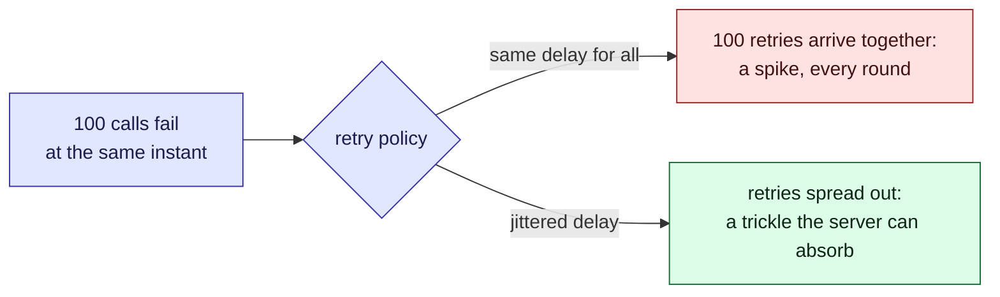

This tour is for anyone about to change how a client retries. By the end you should be able
to say why the [retry policy](/demo/retry-policy.md) has each of its settings, and what breaks
without it. There is a widget in the middle and a [quiz](#quiz) at the end.

## Background

A call can fail for reasons that fix themselves: a server restarting, a brief network blip, a
queue that is full for a second. Retrying turns many of those failures into successes. But a
retry is also extra load, sent at the moment the server is least able to take it.

> [!definition] Backoff
> Waiting longer before each retry than before the last. Exponential backoff doubles the wait
> each time: 0.5 s, 1 s, 2 s, 4 s.

> [!definition] Jitter
> Randomness added to each wait, so two clients with the same policy do not retry at the same
> instant. "Full jitter" picks each wait uniformly between zero and the backoff delay.

## Intuition

Picture a hundred clients connected to one server. The server restarts, and every call in
flight fails in the same millisecond. What happens next depends on the policy.



Try it. Start with **No jitter**, look at the bars, then switch jitter on. Then raise the
retries to 8 and switch the cap off and on.

```widget
retry-backoff
```

> [!tip] What to notice
> Backoff spaces the rounds apart, but it does not space the clients apart. Without jitter,
> every round is still one spike of all the clients at once.

## Details

Each setting in the policy answers one failure mode.

> [!important] The rule
> A retry policy must make the load on a recovering server smaller over time, never larger.

> [!warning] Jitter needs room
> Jitter spreads each retry over the range from zero to its delay. With very short delays
> there is almost nowhere to spread to, so the early rounds still collide. That is why the
> base delay is 500 ms, not 50.

> [!edge-case] The last retry
> Doubling adds up fast: the eighth wait alone is 64 s at a 500 ms base. Without the cap, a
> client can go quiet for over a minute and look hung to its user.

## Quiz

Three questions on the ideas above.

```quiz
A hundred clients use exponential backoff with no jitter. The server fails once. What does the server see?
- [ ] A steady trickle of retries, because each wait is longer than the last
~ Longer waits space out the rounds. Within each round, every client computed the same delay.
- [x] A spike of all the clients at once, in every round
~ Every client started at the same instant with the same policy, so every retry lines up with the others.
- [ ] One spike, then nothing, because backoff stops retries
~ Backoff delays retries; it does not cancel them.
---
Why does the policy cap each wait at 2 s?
- [ ] To make the server recover faster
~ The cap makes clients retry sooner, which is more load, not less. It is there for the client.
- [x] To bound how long a client can go quiet before it tries again
~ Uncapped doubling reaches a minute within eight retries. The cap trades a little load for a client that stays responsive.
- [ ] Because jitter does not work above 2 s
~ Jitter works at any delay; it works better with longer ones.
---
You lower the base delay from 500 ms to 20 ms and keep full jitter. What happens to the first round?
- [ ] It spreads out even more, because there are more retries per second
~ Jitter spreads a retry across its delay. A shorter delay is a narrower window.
- [x] It bunches up again, because every retry lands in the first 20 ms
~ Full jitter only has the range from zero to the delay to work with. A tiny delay leaves the clients almost as bunched as no jitter at all.
- [ ] Nothing changes, because jitter is random
~ Random within a range: the range is what the base delay sets.
```
