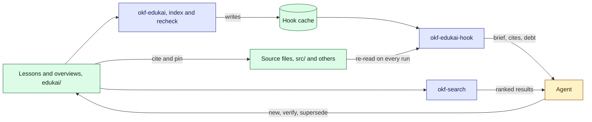

# Agent memory

Parcel tracker keeps two bundles. This one, `okf/`, is the design, written for the team. The
other, `edukai/`, is the **memory bundle**: what agents found out while working on the code,
kept so the next session starts knowing it. In this repository it is `examples/demo/edukai/`.

This page is the map: where things are, how a lesson is found, and how it is kept true. Why
there is a second bundle at all is [ADR-0004](/adr/0004-agent-memory-in-a-second-bundle.md).
The idea behind a lesson, step by step and with a quiz, is the
[memory tour](/tours/memory-explainer.md).

## The whole thing in one picture



Lessons are plain files. One tool writes a cache from them, a second tool reads that cache to
speak to the agent at three moments, and the search reads the lessons directly. The agent
writes back through the first tool, never by editing an old lesson.

## How it is laid out

```text
edukai/
  index.md                      the list of domains, written by the tool
  log.md                        what changed, by date
  codebase-parcel-tracker/
    overview.md                 what agents understand about the code today
    lessons/                    six lessons
  tooling-parcel-tracker/
    overview.md                 how to run the tests and load sample data
    lessons/                    three lessons
```

- A **domain** is one area of knowledge, in one folder. Parcel tracker has two.
- A **lesson** is one claim in one file, named `YYYY-MM-DD-short-claim.md`. Its body is at
  most 30 lines.
- An **overview** is one per domain, at most 60 lines. It says what is understood today,
  links to the lessons under "Current understanding", and lists "Open questions".

## What one lesson holds

The lesson "The poller retries a failed poll five times" carries these fields.

| Field | In that lesson | What it is for |
| --- | --- | --- |
| `confidence` | `tested` | How sure the agent is: `tested` (it reproduced it), `observed` (it saw or read it), `inferred` (it worked it out) |
| `sources` | `src/poller/retry.ts`, with a `sha256:` digest | The files the claim rests on. The digest is the pin: it shows when the file has changed |
| `check` | `contains: "RETRIES = 5"` | A test code can re-run. The four kinds are `contains`, `lacks`, `matches` and `exists` |
| `verified` | signed `claude-code/opus-5.5` | Who confirmed it, and when |
| `stale_after` | 30 days after it was verified | When the lesson needs another look even if nothing changed |
| `supersedes`, `superseded_by` | absent here | The pointers between a replaced lesson and its replacement |

Paths in `sources` and `check` are written from the project root, so the retry settings are
`src/poller/retry.ts`. The digests are written by the tool, not by hand.

## How a lesson is found

There are three ways, and an agent meets them in this order.

| When | What the agent gets | From |
| --- | --- | --- |
| A session opens | The brief: each domain, its lesson count and its overview's path, and how many lessons need an agent | The hook |
| It reads or edits a file | The lessons that cite that file, at most three, each said once in a session | The hook |
| It asks a question no file leads to | Ranked lessons and overviews | The search |

The brief and the file lookup give titles and paths only. The agent opens the lesson to read
the claim. A lesson that has been superseded is left out of the file lookup, and one that is
in the re-check queue is named with its state, such as `[failed · observed]`.

### How the search ranks

`npm run demo:edukai:search -- search "<words>"` runs the same search as the design bundle
uses, pointed at `edukai/`. It scores each lesson and overview on its words, then adjusts the
score by what the frontmatter says.

**The words.** A word counts for more in some places than in others.

| Where the word is | Weight |
| --- | --- |
| Title | 5 |
| Tags | 4 |
| Path | 3 |
| Description | 2.5 |
| Headings | 2 |
| Files it cites (`sources`, `check`) | 3 |
| Body | 1 |

Plurals are trimmed, so "tests" finds "test", and a word finds its other forms, so "caching"
finds "cache". A word that appears nowhere in the bundle is tried as the start of a longer
word, then as a near spelling of one, each at a lower weight. Words a question is asked with
("how", "the") are ignored beside real ones. A rare word counts for more than a common one.

**The adjustments.** Each is a multiplier on the word score. Nothing is hidden: a lesson that
is out of date or replaced is still found, lower down and labelled.

| What the lesson says | Multiplier |
| --- | --- |
| Past its `stale_after` | 0.6 |
| `status: deprecated`, so it was superseded | 0.5 |
| Verified by a person (`human:`) | 1.15 |
| Verified by an agent or a script | 1.05 |
| Not verified | 1 |
| Other concepts link to it | 1.04 for one link, up to 1.2 for five or more |

**One search, worked through.** `search "tests" --explain` at the demo clock gives three
results.

| Result | Word score | Adjustments | Score |
| --- | --- | --- | --- |
| CI runs tests via btest, not make | 0.86 | 1.05 (agent-verified), 1.04 (one link) | 0.94 |
| Parcel tracker's tooling, the overview | 0.66 | none | 0.66 |
| Tests run via make test | 1.06 | 0.6 (stale), 0.5 (deprecated), 1.05, 1.04 | 0.35 |

The replaced lesson has the best words of the three, because "tests" opens its title. It
still comes last, and its result line names the lesson that replaced it.

**Narrowing.** `--type Lesson` drops the overviews, `--confidence tested` keeps only what an
agent reproduced, `--tag poller` keeps one tag, `--fresh` drops anything past its date, and
`--cites examples/demo/src/poller` keeps the lessons that rest on a file under that folder.
`facets` lists the tags, types and trust tiers in use, which is the place to start.

> [!tip] A stale or unverified result is a lead
> The search says what the bundle believes, not what is true. An agent checks a lesson marked
> stale, deprecated or unverified against the file before relying on it. The search also
> knows dates only: the timeout lesson below has a failing check and still shows as fresh
> here. The re-check is what catches it.

## How it is kept true

A lesson's state is never stored. It is worked out from the files each time, so a change made
outside any harness is still caught. The [memory tour](/tours/memory-explainer.md) has the
full state diagram. At the demo clock, 2026-10-15, the nine lessons stand like this.

| State | Lessons | Who acts |
| --- | --- | --- |
| `fresh` | Retries five times; weeks start Monday UTC; CI runs tests via btest | Nobody |
| `renewable` | Two of the five carriers offer webhooks | The tool: the file changed, the check still holds |
| `unverified` | The notifier sends one message per status change | An agent, when it matters |
| `superseded` | Tests run via make test | Nobody |
| `stale` | The API never calls a carrier | An agent: past its date, and it has no check |
| `failed` | The poller times out after ten seconds | An agent: the file now says `8_000` |
| `broken` | The seed script loads sample parcels | An agent: `scripts/seed.ts` is gone |

`npm run demo:edukai:recheck` prints this list. The last three rows are the queue. An agent
clears a `stale` lesson by reading the source again and verifying it, and a `failed` or
`broken` one by writing a new lesson that supersedes it. The old lesson stays, marked
deprecated.

The third moment a hook speaks is when an agent is about to finish. If its own edits in that
session left a lesson `failed`, `broken` or `suspect`, it is told which, and asked to fix it
first. A lesson that was already wrong when the session first read its file is not counted
against that session.

## Two caches

Neither is committed, and deleting either only costs time.

| Cache | Written by | Read by | Where |
| --- | --- | --- | --- |
| The hook cache | `okf-edukai index` | The hook, which cannot parse YAML, so it reads this instead of the lessons | `node_modules/.cache/edukai/` |
| The search cache | `okf-search` | `okf-search` | `node_modules/.cache/okf-search/` |

A project with no `node_modules` gets a private folder in the temp directory instead. A fresh
clone has no hook cache, so `index` runs once first. In this repository
`npm run demo:edukai:brief` does that before it prints the brief.

## Try it

Run these from the repository root. The walkthrough with the expected output is
`examples/demo/README.md`.

| Command | What it shows |
| --- | --- |
| `npm run demo:edukai:brief` | What an agent is told when a session opens |
| `npm run demo:edukai:recheck` | Each lesson's state, and the queue |
| `npm run demo:edukai:search -- search "tests" --explain` | The ranking above, with its arithmetic |
| `npm run demo:edukai:search -- facets` | The tags, types and trust tiers in the memory bundle |
| `npm run demo:edukai:view` | The memory bundle as a graph, in `examples/demo/edukai/viz.html` |
