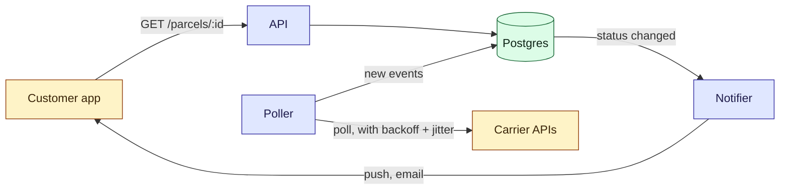

# Architecture

Four parts, one database. The API serves customers; everything else happens in the poller,
which is the only part that talks to carriers.

- **API**: read-mostly; see [API](/parcel-tracker/api.md).
- **Poller**: one loop per carrier. A failed poll is retried under the
  [retry policy](/parcel-tracker/retry-policy.md); a carrier that stays down follows the
  [runbook](/parcel-tracker/runbook-carrier-outage.md).
- **Store**: parcels and their tracking events, described in the
  [data model](/parcel-tracker/data-model.md).
- **Notifier**: sends one message per status change, never one per event.
