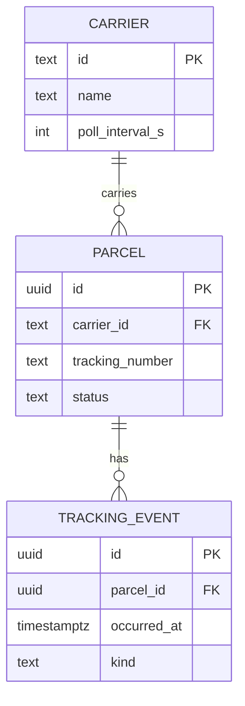

# Data model

- A parcel's `status` is derived from its latest event by `occurred_at`, not by insert order:
  carriers often deliver events late and out of order.
- `occurred_at` is stored in UTC; the [weekly report](/parcel-tracker/weekly-report.md) groups
  by UTC week ([ADR-0002](/adr/0002-weeks-on-the-utc-clock.md)).
