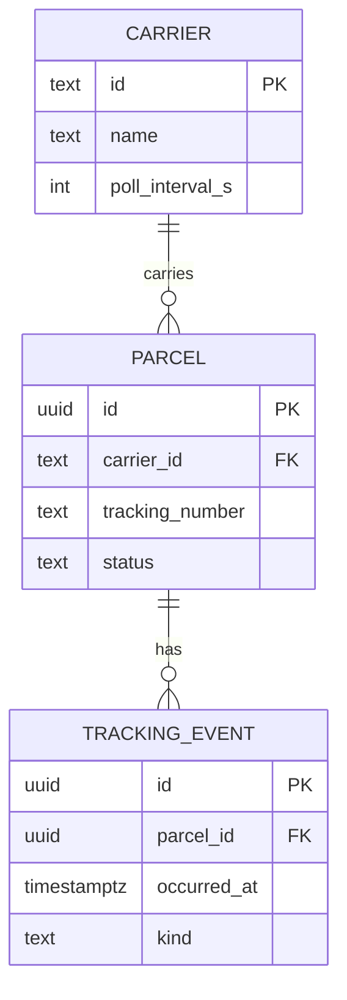

# Data model



<!-- okf:erd-legend -->
> [!note] Reading the diagram
> - `CARRIER ||--o{ PARCEL`: each CARRIER is linked to zero or more PARCEL; each PARCEL is linked to exactly one CARRIER.
> - `PARCEL ||--o{ TRACKING_EVENT`: each PARCEL is linked to zero or more TRACKING_EVENT; each TRACKING_EVENT is linked to exactly one PARCEL.
> - `||`: exactly one
> - `}o` and `o{`: zero or more
> - Columns: `PK` primary key, `FK` foreign key
<!-- /okf:erd-legend -->

- A parcel's `status` is derived from its latest event by `occurred_at`, not by insert order:
  carriers often deliver events late and out of order.
- `occurred_at` is stored in UTC; the [weekly report](/parcel-tracker/weekly-report.md) groups
  by UTC week ([ADR-0002](/adr/0002-weeks-on-the-utc-clock.md)).

## Explore the schema

The diagram above is the small service. The widget below holds the same three tables as SQL, then
a larger scenario: what the model becomes when the company runs its own depots, vehicles and
invoicing. Switch between them and watch what the larger one adds.

The design review marks what is well designed (green) and what is not (amber), and says which
rule each check comes from. Turn off the foreign keys, or edit the SQL, to see the checks fail.
Pick **Join path** to see the SQL between two tables and where rows multiply, and **Delete
impact** to see what removing one row would cascade into.

```widget
sql-erd
-- scenario: Parcel tracker | The three tables the service runs on today.
CREATE TABLE carrier (
  id              text PRIMARY KEY,
  name            text NOT NULL UNIQUE,
  poll_interval_s int  NOT NULL
);

CREATE TABLE parcel (
  id              uuid PRIMARY KEY,
  carrier_id      text NOT NULL REFERENCES carrier (id),
  tracking_number text NOT NULL,
  status          text NOT NULL,
  UNIQUE (carrier_id, tracking_number)
);

CREATE TABLE tracking_event (
  id          uuid PRIMARY KEY,
  parcel_id   uuid NOT NULL REFERENCES parcel (id) ON DELETE CASCADE,
  occurred_at timestamptz NOT NULL,
  kind        text NOT NULL
);
CREATE INDEX tracking_event_by_parcel ON tracking_event (parcel_id, occurred_at);

-- scenario: Parcel ops | The same service grown into a depot network with routes, drivers and invoicing.
CREATE TABLE customer (
  id    uuid PRIMARY KEY,
  name  text NOT NULL,
  email text NOT NULL UNIQUE
);

CREATE TABLE address (
  id          uuid PRIMARY KEY,
  customer_id uuid NOT NULL REFERENCES customer (id) ON DELETE CASCADE,
  line1       text NOT NULL,
  city        text NOT NULL,
  postcode    text NOT NULL
);
CREATE INDEX address_by_customer ON address (customer_id);

CREATE TABLE carrier (
  id              text PRIMARY KEY,
  name            text NOT NULL UNIQUE,
  poll_interval_s int  NOT NULL
);

CREATE TABLE depot (
  id   uuid PRIMARY KEY,
  name text NOT NULL,
  city text NOT NULL
);

CREATE TABLE vehicle (
  id          uuid PRIMARY KEY,
  depot_id    uuid NOT NULL REFERENCES depot (id),
  plate       text NOT NULL UNIQUE,
  capacity_kg int  NOT NULL
);
CREATE INDEX vehicle_by_depot ON vehicle (depot_id);

CREATE TABLE driver (
  id       uuid PRIMARY KEY,
  depot_id uuid NOT NULL REFERENCES depot (id),
  name     text NOT NULL,
  phone1   text,
  phone2   text
);
CREATE INDEX driver_by_depot ON driver (depot_id);

CREATE TABLE route (
  id          uuid PRIMARY KEY,
  depot_id    uuid NOT NULL REFERENCES depot (id),
  vehicle_id  uuid NOT NULL REFERENCES vehicle (id),
  driver_id   uuid REFERENCES driver (id) ON DELETE SET NULL,
  planned_for date NOT NULL
);
CREATE INDEX route_by_depot_day ON route (depot_id, planned_for);
CREATE INDEX route_by_vehicle ON route (vehicle_id);
CREATE INDEX route_by_driver ON route (driver_id);

CREATE TABLE parcel (
  id                   uuid PRIMARY KEY,
  carrier_id           text NOT NULL REFERENCES carrier (id),
  sender_id            uuid NOT NULL REFERENCES customer (id),
  recipient_address_id uuid NOT NULL REFERENCES address (id),
  tracking_number      text NOT NULL,
  status               text NOT NULL,
  shipping_fee         real,
  UNIQUE (carrier_id, tracking_number)
);
CREATE INDEX parcel_by_sender ON parcel (sender_id);
CREATE INDEX parcel_by_address ON parcel (recipient_address_id);

CREATE TABLE route_stop (
  route_id  uuid NOT NULL REFERENCES route (id) ON DELETE CASCADE,
  parcel_id uuid NOT NULL REFERENCES parcel (id),
  seq       int  NOT NULL,
  PRIMARY KEY (route_id, parcel_id)
);

CREATE TABLE tracking_event (
  id          uuid PRIMARY KEY,
  parcel_id   uuid NOT NULL REFERENCES parcel (id) ON DELETE CASCADE,
  depot_id    uuid REFERENCES depot (id) ON DELETE SET NULL,
  occurred_at timestamptz NOT NULL,
  kind        text NOT NULL
);
CREATE INDEX tracking_event_by_parcel ON tracking_event (parcel_id, occurred_at);
CREATE INDEX tracking_event_by_depot ON tracking_event (depot_id);

CREATE TABLE delivery_exception (
  id          uuid PRIMARY KEY,
  parcel_id   uuid NOT NULL REFERENCES parcel (id),
  reason      text NOT NULL,
  opened_at   timestamp NOT NULL,
  resolved_at timestamptz
);
CREATE INDEX delivery_exception_by_parcel ON delivery_exception (parcel_id);

CREATE TABLE invoice (
  id          uuid PRIMARY KEY,
  customer_id uuid NOT NULL REFERENCES customer (id),
  issued_on   date NOT NULL,
  total       numeric(12, 2) NOT NULL
);
CREATE INDEX invoice_by_customer ON invoice (customer_id);

CREATE TABLE invoice_line (
  invoice_id uuid NOT NULL REFERENCES invoice (id) ON DELETE CASCADE,
  parcel_id  uuid NOT NULL REFERENCES parcel (id),
  amount     numeric(12, 2) NOT NULL,
  PRIMARY KEY (invoice_id, parcel_id)
);
```
