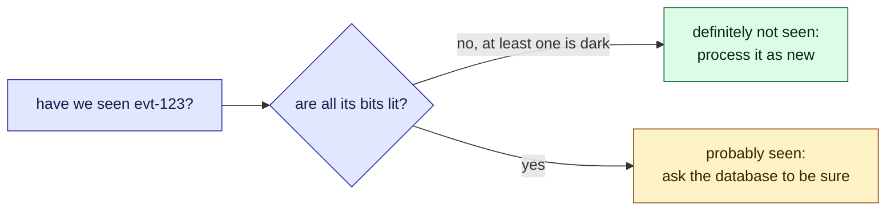

This tour is for anyone who has to ask "have I already processed this?" about a very large
set of ids. Each time the [poller](/parcel-tracker/architecture.md) reads a carrier, it gets
events it may already have stored, and it has to tell the new ones apart. Asking the database
for every one is slow. A Bloom filter is one way to skip most of those questions. It is not in
Parcel tracker today; this tour is for deciding. There is a widget in the middle and a
[quiz](#quiz) at the end.

## Background

A Bloom filter is an array of bits and a few hash functions. To add a key, hash it several
times and set the bits it points at. To ask about a key, hash it the same way and check those
bits.

> [!definition] False positive
> The filter says "probably seen" for a key that was never added, because other keys happened
> to light all the bits it points at.

> [!definition] False negative
> The filter says "never seen" for a key that was added. A Bloom filter cannot do this: adding
> only ever sets bits, and nothing clears them.

## Intuition

The two answers are not equally trustworthy.



Try it. Ask about `evt-7`, which was added, then `evt-999`, which was not. Then try **Far too
many keys**, and **Too many hashes**, and watch the share of bits that are lit.

```widget
bloom-filter
```

> [!tip] What to notice
> The share of never-added keys that get a "yes" goes up as the bits fill. Hash functions help until each key lights
> so many bits that the array fills; there is a best number, about 0.69 times the bits per key.

## Details

> [!important] The rule
> Use "no" as an answer and "yes" as a hint. Treat a Bloom filter as a fast filter in front of
> the authoritative check, never as the check.

> [!warning] Skipping on "yes" loses data
> If the poller skipped every event the filter says it has seen, about one new event in a
> hundred would be dropped at the widget's default size, silently. The filter may only save
> work: a "yes" must still be confirmed.

> [!edge-case] It cannot forget
> There is no delete. Clearing a bit would break other keys that share it. A filter that must
> forget (events older than a month) is rebuilt on a schedule, or replaced by a variant that
> counts.

## Quiz

Three questions on the ideas above.

```quiz
A Bloom filter answers "probably seen" for a key. What do you know?
- [ ] The key was definitely added
~ Other keys may have lit all of its bits. That is a false positive.
- [x] The key was either added, or it is a false positive: you cannot tell which
~ That is why a "yes" must be confirmed against the real store.
- [ ] Nothing: the answer is random
~ The "no" answers are certain, and the "yes" answers are right most of the time at a sensible size.
---
The poller skips any event the filter says it has seen, and never checks the database. What goes wrong?
- [ ] Duplicate events get stored
~ Duplicates are the case where "yes" is right. The filter does not cause that.
- [x] New events are silently dropped whenever the filter gives a false positive
~ The lost events are never stored or notified, and nothing reports them.
- [ ] Nothing, a Bloom filter never lies
~ It never lies with a "no". A "yes" can be wrong.
---
You keep adding keys to a fixed-size Bloom filter. What happens to the share of never-added keys that get a "yes"?
- [ ] It stays the same, because the hash functions do not change
~ The hashes stay the same, but there are fewer dark bits for a stranger to hit.
- [x] It climbs towards every question being answered "yes"
~ Try "Far too many keys": every bit is lit and the filter says yes to anything.
- [ ] It falls, because the filter learns the keys
~ A Bloom filter does not learn; it only sets bits.
```
