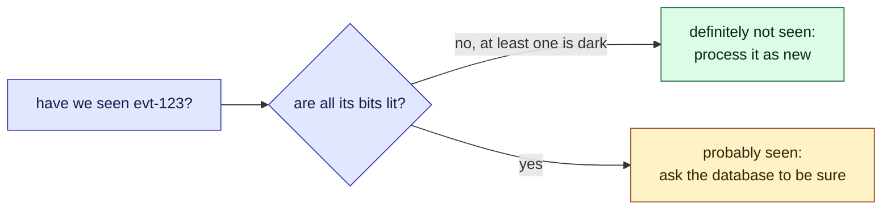

This tour is for anyone who must ask "have I seen this id before?" about a large set. After
it, you will know what a Bloom filter can answer, and what it cannot. Parcel tracker does not
use one today; this tour helps decide. A [quiz](#quiz) closes it.

## Who is affected

| Person | What it means to them |
| --- | --- |
| **Sam**, on call | Checking every event against the database is many slow queries |
| **Dana**, at the carrier | Her feed repeats recent events on purpose, so clients can catch up |
| **Amira**, a customer | If a new event is thrown away, she never hears "out for delivery" |

## Background

A Bloom filter is a row of bits, all starting at 0. To add a key (here, an event
id), hash it a few times and set those bits to 1. To ask about a key, hash it the same way and check those bits.

> [!definition] False positive
> The filter says "probably seen" for a key it never saw, because other keys happened to set
> all of its bits.

> [!definition] False negative
> The filter says "never seen" for a key it did see. This cannot happen: bits are only ever
> set, never cleared.

## The problem, one step at a time

1. **The [poller](/parcel-tracker/architecture.md) reads Dana's feed.** It gets 200 events;
   most are already stored.
2. **It asks the database about each one.** That is 200 queries for a handful of new events.
   *Sam* sees the load.
3. **A Bloom filter answers first, from memory.** "No" means certainly new. "Yes" means
   *probably* seen.
4. **"Probably" is the catch.** Skip every "yes", and a few new events are lost. *Amira* never
   hears her parcel is out for delivery.
5. **So the filter only saves work.** A "no" skips the query; a "yes" still asks the database.

## The picture

The two answers are not equally trustworthy.



Try it, in four steps. A lit cell is a bit set to 1. The ringed cells are the bits a key
hashes to.

1. **Working well.** Open on **Sized for the job**. Ask about `evt-7` (added), then `evt-999`
   (not added). The first is always "yes"; the second is almost always "no". False positives
   stay under 1%.
2. **Too small.** Click **Far too many keys**. Every bit is lit, so every answer is "maybe".
   The filter saves nothing.
3. **One hash.** Click **A single hash**. A stranger needs only one lit bit to pass, so about
   9% of them get a "yes".
4. **Too many hashes.** Click **Too many hashes**. Each key now lights sixteen bits, so the
   row fills faster. False positives are worse than with seven.

```widget
bloom-filter
```

> [!tip] What to notice
> False positives rise as the bits fill. More hashes help until they fill the row. The best
> number is about 0.69 times the bits per key.

## Details

> [!important] The rule
> Trust "no". Treat "yes" as a hint. A Bloom filter sits in front of the real check; it never
> replaces it.

> [!warning] Skipping on "yes" loses data
> At the widget's default size, about one new event in a hundred would be dropped, and nothing
> would report it.

> [!edge-case] It cannot forget
> There is no delete: clearing a bit would break other keys that share it. To forget old
> events, rebuild the filter on a schedule, or use a counting variant.

## Quiz

Three questions on the ideas above.

```quiz
A Bloom filter answers "probably seen" for a key. What do you know?
- [ ] The key was definitely added
~ Other keys may have lit all its bits. That is a false positive.
- [x] The key was either added, or it is a false positive: you cannot tell which
~ That is why a "yes" must be confirmed against the real store.
- [ ] Nothing: the answer is random
~ "No" is certain, and "yes" is right most of the time at a sensible size.
---
The poller skips any event the filter says it has seen, and never checks the database. What goes wrong?
- [ ] Duplicate events get stored
~ Duplicates are where "yes" is right. The filter does not cause them.
- [x] New events are silently dropped whenever the filter gives a false positive
~ They are never stored or notified, and nothing reports them.
- [ ] Nothing, a Bloom filter never lies
~ It never lies with a "no". A "yes" can be wrong.
---
You keep adding keys to a fixed-size Bloom filter. What happens to the share of never-added keys that get a "yes"?
- [ ] It stays the same, because the hash functions do not change
~ The hashes stay the same, but fewer bits stay dark.
- [x] It climbs towards every question being answered "yes"
~ Try "Far too many keys": every bit is lit and the filter says yes to anything.
- [ ] It falls, because the filter learns the keys
~ A Bloom filter does not learn; it only sets bits.
```
