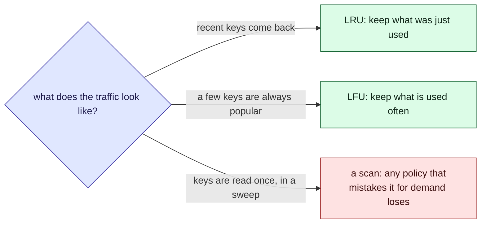

This tour is for anyone about to put a cache in front of a lookup. Parcel tracker has none
today: [`GET /parcels/:id`](/parcel-tracker/api.md) reads straight from the database. The tour
is for deciding whether to add one, and what it should throw away when it is full. There is a
widget in the middle and a [quiz](#quiz) at the end.

## Background

A cache holds a few recent answers so repeat questions skip the slow path. It has room for
only so many, so each time it is full and a new key arrives, something has to go. The rule for
choosing is the **eviction policy**.

> [!definition] Hit rate
> The share of requests answered from the cache. A request that finds its key is a hit; one
> that does not is a miss, and pays for the slow path.

> [!definition] Eviction policy
> The rule that picks which entry to remove. FIFO removes the oldest arrival, LRU the entry
> used longest ago, LFU the entry used least often. OPT removes the one needed furthest in the
> future; it cannot be built, but it is the best any policy could do, so it shows the ceiling.

## Intuition

No policy wins everywhere. Each one is a bet about what the next request looks like.



Try it. Start with **Belady's anomaly** and read the table at the bottom. Then try **A scan
pushes out the hot keys** and switch between LRU and LFU. Then try **A loop one key too big**
and raise the cache size by one.

```widget
cache-policy
```

> [!tip] What to notice
> The table runs every policy on the same requests at your size and one larger. FIFO can get
> worse when you add room. LRU and OPT cannot. Whether a policy is "smart" matters less than
> whether its bet matches the traffic.

## Details

> [!important] The rule
> Choose an eviction policy from the shape of the requests you will actually see, and measure
> the hit rate on a trace of them. Do not choose it by how clever it sounds.

> [!warning] A sweep can empty a cache
> One job that reads every parcel once, such as a nightly export, looks like a burst of new
> keys. An LRU cache treats each one as recent and drops the hot entries to make room. Run
> sweeps around the cache, or use a policy that counts frequency.

> [!edge-case] The loop that is one too big
> If requests cycle through N keys and the cache holds N - 1, LRU and FIFO miss every time,
> because each key is evicted just before it comes round again. One more entry turns zero hits
> into nearly all hits. Hit rate can jump, not just creep, with size.

## Quiz

Three questions on the ideas above.

```quiz
You give a FIFO cache room for one more entry and its hit rate falls on the same requests. Is that a bug?
- [ ] Yes, a bigger cache can never miss more
~ That holds for LRU and OPT, which keep a superset of the smaller cache's entries. FIFO has no such guarantee.
- [x] No, it is Belady's anomaly: FIFO evicts by age, so extra room can change which entries are oldest at the wrong moment
~ The widget's first preset shows it: three entries beat four on that request list.
- [ ] Only if the cache is also full of stale entries
~ Staleness is a different problem; this effect appears with no expiry at all.
---
A nightly job reads every parcel once. Afterwards the app is slow for a while. Which is the most likely cause?
- [ ] The scan raised the hit rate, which overloads the database
~ A hit is cheaper than a miss. It is the misses that load the database.
- [x] An LRU cache treated each one-off read as recent and evicted the hot entries
~ After the sweep, the popular keys are gone and every one of them must be fetched again.
- [ ] LFU evicts entries when the cache is idle
~ LFU only evicts when it needs room, and it resists scans.
---
Requests loop over four keys, and the cache holds three. What does LRU's hit rate look like?
- [ ] About three quarters, because three of four keys fit
~ LRU evicts the key that will be needed next, so having room for most of the loop does not help.
- [x] Zero after the first lap: each key is evicted just before it is asked for again
~ Raise the size to four and the same traffic hits almost every time.
- [ ] Whatever the cache size divided by the number of keys
~ That would be the case for random requests, not a repeating loop.
```
