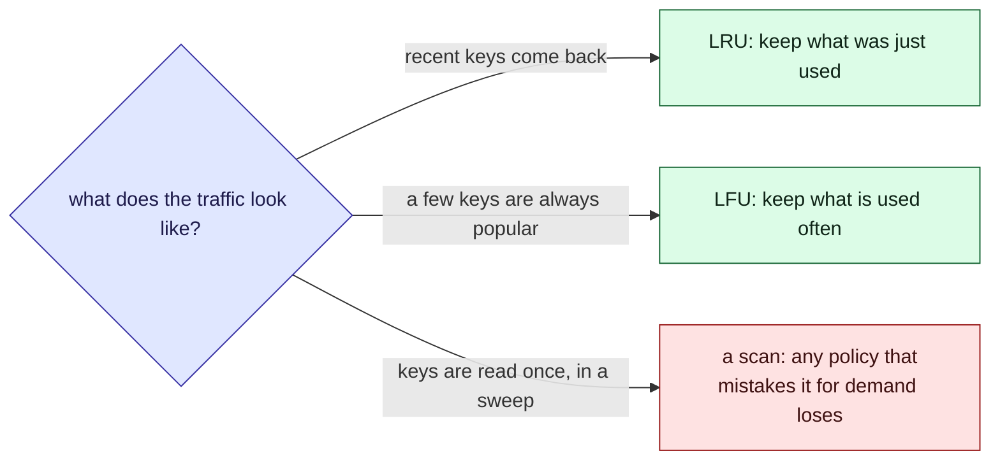

This tour is for anyone about to put a cache in front of a lookup. After it, you will know how
to choose what a full cache throws away. Parcel tracker has no cache today:
[`GET /parcels/:id`](/parcel-tracker/api.md) reads the database every time. A [quiz](#quiz)
closes it.

## Who is affected

| Person | What a cache means to them |
| --- | --- |
| **Amira**, a customer | Her page is instant on a hit, and waits on the database on a miss |
| **Sam**, on call | Every miss is a database read; too many misses and the cache protects nothing |
| **Lee**, an analyst | His nightly export reads every parcel once: the worst traffic for a cache |

## Background

A cache keeps a few recent answers, so repeat questions skip the slow path. When it is full,
something must go to make room.

> [!definition] Hit rate
> The share of requests answered from the cache. A hit finds its key. A miss does not, and
> pays for the slow path.

> [!definition] Eviction policy
> The rule for what to throw out. FIFO: the oldest arrival. LRU: the least recently used.
> LFU: the least often used. OPT: the one needed furthest in the future. OPT needs to see the
> future, so it cannot be built; it shows the best possible score.

## The problem, one step at a time

Say the cache holds four parcels.

1. **Amira opens her parcel and refreshes.** The first request misses; the rest hit.
2. **A few popular parcels get most of the traffic.** They stay cached, and the database is
   quiet.
3. **At 02:00, Lee's export reads every parcel once.** Hundreds of one-off keys arrive.
4. **The cache makes room for each one.** A policy that treats "new" as "important" throws out
   the popular parcels. In the morning *Amira*'s page is slow, and *Sam* sees the database
   spike.



No policy wins everywhere. Each one bets on what the next request looks like.

## Try it, in four steps

The widget replays a list of requests. The table at the bottom runs every policy on them.

1. **Skewed traffic.** Click **Skewed traffic**. Most lookups are for one carrier. Even with
   two entries, FIFO hits 29%, LRU 43% and LFU 50%. Same cache, same requests.
2. **Lee's export.** Click **A scan pushes out the hot keys**. Under LRU, watch the hot keys
   `a` and `b` get evicted. Switch to LFU and they survive.
3. **One key too many.** Click **A loop one key too big**. Four keys cycle through room for
   three, and LRU misses every time. Add one slot and the hit rate jumps from 0% to 75%.
4. **Bigger can be worse.** Click **Belady's anomaly** and read the table. With FIFO, the
   bigger cache hits *less*. So Sam should measure on real traffic.

```widget
cache-policy
```

> [!tip] What to notice
> The table shows each policy at your size and one larger. FIFO can get worse with more room;
> LRU and OPT cannot. What matters is whether a policy's bet matches the traffic.

## Details

> [!important] The rule
> Choose a policy from the traffic you will really see. Measure its hit rate on a recording
> of that traffic.

> [!warning] A sweep can empty a cache
> A job that reads everything once, like a nightly export, looks like many new keys. LRU keeps
> them and drops the hot entries. Send sweeps around the cache, or use a policy that counts
> use.

> [!edge-case] The loop that is one too big
> If requests cycle through N keys and the cache holds N - 1, LRU and FIFO miss every time:
> each key is evicted just before it comes back. One more slot turns no hits into nearly all
> hits.

## Quiz

Three questions on the ideas above.

```quiz
You give a FIFO cache room for one more entry and its hit rate falls on the same requests. Is that a bug?
- [ ] Yes, a bigger cache can never miss more
~ That holds for LRU and OPT: the bigger cache always keeps everything the smaller one would. FIFO has no such guarantee.
- [x] No, it is Belady's anomaly: FIFO evicts by age, so extra room can change which entries are oldest at the wrong moment
~ The widget's first preset shows it: three entries beat four on that request list.
- [ ] Only if the cache is also full of stale entries
~ Staleness is a different problem; this happens with no expiry at all.
---
A nightly job reads every parcel once. Afterwards the app is slow for a while. Which is the most likely cause?
- [ ] The scan raised the hit rate, which overloads the database
~ A hit is cheaper than a miss. Misses load the database.
- [x] An LRU cache treated each one-off read as recent and evicted the hot entries
~ The popular keys are gone, and each must be fetched again.
- [ ] LFU evicts entries when the cache is idle
~ LFU only evicts when it needs room, and it resists scans.
---
Requests loop over four keys, and the cache holds three. What does LRU's hit rate look like?
- [ ] About three quarters, because three of four keys fit
~ LRU evicts the very key needed next, so fitting most of the loop does not help.
- [x] Zero after the first lap: each key is evicted just before it is asked for again
~ Raise the size to four and the same traffic hits almost every time.
- [ ] Whatever the cache size divided by the number of keys
~ That is true of random requests, not a repeating loop.
```
