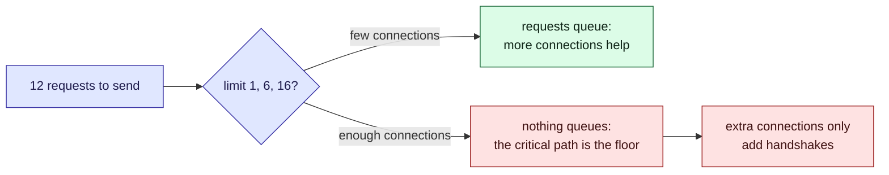

This tour is for anyone choosing how many requests a client sends at once. After it, you will
know where adding more stops helping. The widget's timings are made up for the example. A
[quiz](#quiz) closes it.

## Who is affected

| Person | What the limit means to them |
| --- | --- |
| **Amira**, a customer | A slow poll cycle means a stale status on her page |
| **Sam**, on call | Sets the limit, and is paged if the poller runs out of connections |
| **Dana**, at the carrier | Every connection we open is one her servers must hold open |

## Background

Sending requests side by side lets their waits overlap, so the batch ends sooner. The
**concurrency limit** is how many may be in flight at once.

> [!definition] Critical path
> The longest chain of requests where each must wait for the one before. Its steps cannot
> overlap, so no limit can make the batch shorter than this chain.

> [!definition] Handshake
> The set-up cost of a new connection (TCP and TLS), paid before its first request. Reusing a
> connection is free. HTTP/2 runs many requests as streams on one connection, so it pays once.

## The problem, one step at a time

Suppose a poll cycle sends twelve requests: a token, a depot list, nine carrier feeds, and the
events, which refer to the depots.

1. **First, the token.** Nothing else can start until it arrives.
2. **Then the depot list and nine feeds can all go.** With a limit of one, they queue, and
   *Amira* waits for all of them in turn.
3. **The events must wait for the depot list.** So token, depots, events is the shortest the
   cycle can ever be.
4. **Once nothing queues, more connections help no one.** Each new one costs a handshake, an
   open socket for *Dana*, and a file handle for *Sam*.



## Try it, in four steps

Each row is a connection, each bar a request. Time runs left to right.

1. **Slow.** Click **One at a time**. Everything queues. The total is 1,930 ms: all the work
   plus one handshake.
2. **Enough.** Click **Six connections (HTTP/1.1)**. The total drops to 580 ms, the floor.
   Six is what a browser uses.
3. **Too many.** Click **Unlimited connections**. Still 580 ms, but ten rows and ten
   handshakes. Amira gains nothing; Dana holds four more connections per worker.
4. **Another way.** Click **One connection, many streams (HTTP/2)**. One handshake, the same
   580 ms.

```widget
http-concurrency
token 80
depots 220 after=token
feed1 140 after=token
feed2 160 after=token
feed3 120 after=token
feed4 180 after=token
feed5 150 after=token
feed6 170 after=token
feed7 130 after=token
feed8 190 after=token
feed9 110 after=token
events 240 after=depots
```

> [!tip] What to notice
> While requests queue, a higher limit helps. Once nothing queues, the total sits at the
> critical path (token, depots, events), and each extra connection is a wasted handshake.

## Details

> [!important] The rule
> Set the limit where requests stop queueing, not higher. Above that, you pay in connections
> and gain nothing.

> [!warning] The model is kinder than the network
> In the widget, a request takes the same time however many run together. A real carrier slows
> under load, so the gains stop sooner. Too many connections can even look like an attack.

> [!edge-case] A dependent request in the middle
> A request that waits for another splits the batch in two. If it is also slow, it sets the
> floor alone. Shortening that chain (fetch the depot list earlier, or cache it) beats any
> limit.

## Quiz

Three questions on the ideas above.

```quiz
Nothing is queueing at a limit of 12, and the batch takes 580 ms. You raise the limit to 24. What happens to the total?
- [ ] It halves, because twice as many requests can run
~ Only requests waiting for a connection benefit, and none are.
- [x] It does not improve, and it may get worse if the extra connections pay handshakes
~ The floor is set by the critical path, or by the work spread over the connections. Past that, only costs grow.
- [ ] It improves until the limit equals the number of requests
~ At 12 it already does.
---
What sets the shortest time a batch of requests can take, whatever the concurrency?
- [ ] The slowest single request
~ Only part of it: a chain of dependent requests adds up.
- [x] The longest chain of requests that each wait for the one before
~ That chain cannot overlap, so the batch cannot finish sooner.
- [ ] The number of connections the browser allows
~ That limits how much can overlap, not how long the chain takes.
---
Why does one HTTP/2 connection often beat six HTTP/1.1 connections for the same requests?
- [ ] It makes each request faster on the wire
~ The requests take the same time; only the overhead changes.
- [x] It pays one handshake and still lets many requests be in flight as streams
~ In the widget, six connections pay six handshakes; the shared one pays one and reaches the same floor.
- [ ] It removes the dependency between requests
~ A request that needs another's answer still has to wait.
```
