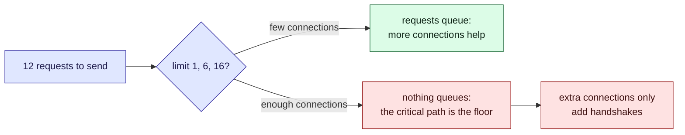

This tour is for anyone choosing how many requests a client sends in parallel. Suppose a poll
cycle in Parcel tracker first fetches a token, then reads eleven carrier feeds, and one feed
(the one for each carrier's depot list) has to be read before the events that refer to it.
How many of those should run at once? There is a widget in the middle and a [quiz](#quiz) at
the end. The widget's numbers are made up for the example; they are not measurements of any
real carrier.

## Background

A client can send requests one after another or several at a time. Sending several at a time
hides each request's wait behind the others, so the batch finishes sooner. The limit on how
many may be in flight at once is the **concurrency limit**.

> [!definition] Critical path
> The longest chain of requests where each one has to wait for the one before. Nothing in that
> chain can overlap, so no concurrency limit can make the batch finish sooner than its length.

> [!definition] Handshake
> The cost of opening a connection (TCP and TLS) before the first byte of a request. A
> connection that already served a request is reused for free; a new one pays again. HTTP/2
> sends many requests as streams on one connection, so it pays once.

## Intuition

Parallelism shortens the batch until one of two ceilings stops it.



Try it. Start at **One at a time**, then **Six connections**, then **Unlimited connections**
and compare the total with the floor. Then switch to **One connection, many streams**.

```widget
http-concurrency
token 80
depots 220 after=token
feed1 140 after=token
feed2 160 after=token
feed3 120 after=token
feed4 180 after=token
feed5 150 after=token
feed6 170 after=token
feed7 130 after=token
feed8 190 after=token
feed9 110 after=token
events 240 after=depots
```

> [!tip] What to notice
> The floor line names the two ceilings. While requests are queueing, raising the limit helps.
> Once nothing queues, the total sits at the critical path (token, then depots, then events)
> and every connection you add is a handshake you paid for.

## Details

> [!important] The rule
> Set the concurrency limit to where requests stop queueing, not higher. Past that point
> extra concurrency buys nothing, and it costs connections on the carrier's side.

> [!warning] The model is kinder than the network
> The widget lets every request take its stated time however many run together. A real carrier
> slows down under load, so the benefit of high concurrency falls off sooner than shown, and
> a limit the carrier does not expect can look like an attack.

> [!edge-case] A dependent request in the middle
> One request that must wait for another splits the batch in two. If it is also slow, it
> becomes the floor on its own. Shortening the critical path (fetching the depot list
> earlier, or caching it) helps more than any limit.

## Quiz

Three questions on the ideas above.

```quiz
Nothing is queueing at a limit of 12, and the batch takes 580 ms. You raise the limit to 24. What happens to the total?
- [ ] It halves, because twice as many requests can run
~ Only requests that are waiting for a connection benefit, and none are.
- [x] It does not improve, and it may get worse if the extra connections pay handshakes
~ The floor is the critical path or the work spread over the connections. Past that, only costs grow.
- [ ] It improves until the limit equals the number of requests
~ That is already the case at 12 requests in flight.
---
What sets the shortest time a batch of requests can take, whatever the concurrency?
- [ ] The slowest single request
~ That is only a part of it: a chain of dependent requests adds up.
- [x] The longest chain of requests that each wait for the one before
~ Nothing in that chain can overlap, so the batch cannot finish sooner.
- [ ] The number of connections the browser allows
~ That limits how much can overlap, not how little time the dependent chain needs.
---
Why does one HTTP/2 connection often beat six HTTP/1.1 connections for the same requests?
- [ ] It makes each request faster on the wire
~ The requests take the same time; what changes is the overhead around them.
- [x] It pays one handshake and still lets many requests be in flight as streams
~ In the widget the six-connection run opens six connections and pays a handshake on each; the shared connection pays one and reaches the same floor.
- [ ] It removes the dependency between requests
~ A request that needs another's answer still has to wait.
```
