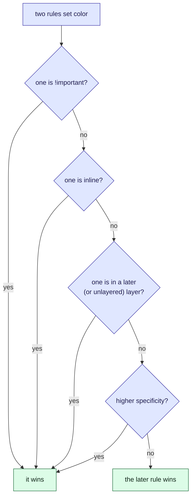

This tour is for anyone who has added a CSS rule that did nothing. Suppose the customer app
shows a parcel's status as a badge, and a late parcel has to look red, but it stays green.
Both rules match the badge, so the browser has to choose. This tour shows how. There is a
widget in the middle and a [quiz](#quiz) at the end.

## Background

When several rules set the same property on the same element, the browser does not take the
last one it read. It runs a fixed series of tie-breakers, and stops at the first that decides.

> [!definition] Specificity
> A score for how targeted a selector is, written as three counts: ids, then classes
> (including attributes and pseudo-classes), then element types. The counts are compared left
> to right, so a single id outranks any number of classes.

> [!definition] The cascade
> In order: `!important` first, then the inline `style` attribute, then cascade layers, then
> specificity, and finally whichever rule comes last in the source.

## Intuition

Read the series from the top, and the rule that is decided early never needs the later checks.



Try it. The widget starts with the badge's situation: a `.badge.late` rule against the
`#parcel .status` rule that styled it green. Click **Ten classes against one id**, then **!important
beats an id**, and edit a selector to see its score change.

```widget
css-specificity
.badge.late | crimson
#parcel .status | seagreen
.badge | royalblue
```

> [!tip] What to notice
> The score is three separate columns. Ten classes are (0, 10, 0) and one id is (1, 0, 0), and
> the id wins, because the columns are compared one at a time and never carry.

## Details

> [!important] The rule
> Fix a losing rule by changing its place in the cascade, or by making it as specific as the
> rule it is fighting. Adding `!important` is a way of losing the same argument later, against
> the next `!important`.

> [!warning] `:is()` takes the strongest argument
> `:is(#status, .big) a` scores as if the id were there, even on an element that only matches
> `.big`. `:where()` always scores zero, which makes it the right tool for defaults that
> should be easy to override.

> [!edge-case] Layers reorder everything
> An `@layer` is checked before specificity, and unlayered rules beat layered ones. A
> framework's `#id` selector inside an early layer loses to your plain class outside any layer.
> With `!important` the order of layers reverses.

## Quiz

Three questions on the ideas above.

```quiz
A rule with ten class selectors and a rule with one id selector match the same element. Which wins?
- [ ] The ten classes, because (0, 10, 0) is a bigger number
~ Specificity is compared column by column, not added up. Ten classes never carry into the id column.
- [x] The id, because a single id outranks any number of classes
~ Compare the first column first: 1 beats 0, and the comparison stops there.
- [ ] Whichever is later in the stylesheet
~ Source order only breaks a tie in specificity.
---
Your `.late` rule is overridden by an id rule. What is the least fragile fix?
- [ ] Add `!important` to `.late`
~ It works until the next rule uses `!important`, and makes the stylesheet harder to reason about.
- [x] Move the competing rule into a lower-priority cascade layer, or lower its specificity
~ Changing where it sits in the cascade fixes the cause instead of raising the stakes.
- [ ] Repeat the class in the selector until the score is high enough
~ It can work, but it is a specificity arms race, and ten classes still lose to one id.
---
What is the specificity of `:where(#status) a.link`?
- [ ] (1, 1, 1)
~ :where() always counts as zero, whatever is inside it.
- [x] (0, 1, 1)
~ The class `.link` is one, and the element `a` is one. The id inside :where() adds nothing.
- [ ] (0, 0, 1)
~ The `.link` class still counts.
```
