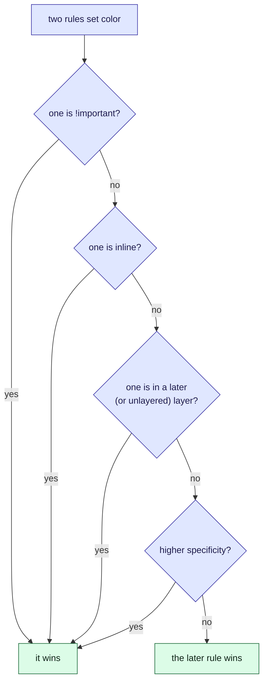

This tour is for anyone who has written a CSS rule that did nothing. After it, you will know
how the browser picks between two rules, and how to fix the loser without `!important`. A
[quiz](#quiz) closes it.

## Who is affected

| Person | What the badge colour means to them |
| --- | --- |
| **Amira**, a customer | A green badge on a late parcel reads as "all fine" |
| **Noor**, a front-end developer | Wrote the red rule and cannot see why it does nothing |
| **Sam**, a year later | Finds `!important` on the badge and must decide if it is safe to remove |

## Background

When two rules set the same property on one element, the browser does not just take the last
one. It runs a fixed list of tie-breakers and stops at the first that decides.

> [!definition] Specificity
> A score for how targeted a selector is, as three counts: ids, then classes (and attributes
> and pseudo-classes), then element names. Compare left to right, so one id beats any number
> of classes.

> [!definition] The cascade
> The tie-breakers, in order: `!important`, then the inline `style` attribute, then cascade
> layers, then specificity, then whichever rule comes last.

## The problem, one step at a time

1. **Amira's parcel is late.** Its badge, `<span class="status badge late">` inside
   `<div id="parcel">`, should be red.
2. **Noor writes `.badge.late { color: crimson }`.** It matches the badge. Nothing happens.
3. **An older rule, `#parcel .status`, also matches** and sets the colour to green.
4. **Specificity decides.** The old rule has an id; Noor's has only classes. *Amira* sees
   green.
5. **Noor adds `!important`, and it works.** A year later *Sam* cannot remove it without
   risking some other badge.

## The picture

Read from the top. The first check that separates the rules decides.



Try it, in four steps. The list under "Strongest first" is the browser's verdict.

1. **Noor's rules.** The widget opens on the page's own rules. See which colour wins, and
   which check decided it.
2. **Why the id wins.** Click **Ten classes against one id**. Ten classes score (0, 10, 0);
   one id scores (1, 0, 0). The first column decides.
3. **Noor's shortcut.** Click **!important beats an id**. `!important` is checked before
   specificity. That is how override wars start.
4. **Sam's cleaner fix.** Click **Cascade layers** or **A tie: the later rule wins**. Each
   moves a rule's place in the cascade without escalating.

```widget
css-specificity
.badge.late | crimson
#parcel .status | seagreen
.badge | royalblue
```

> [!tip] What to notice
> The score is three columns, compared one at a time. They never carry: ten classes are still
> (0, 10, 0), and lose to (1, 0, 0).

## Details

> [!important] The rule
> Fix a losing rule by moving its place in the cascade, or by matching the other rule's
> specificity. `!important` only loses the same fight later, to the next `!important`.

> [!warning] `:is()` takes the strongest argument
> `:is(#status, .big) a` scores as if the id were there, even when only `.big` matches.
> `:where()` always scores zero, so use it for defaults that should be easy to override.

> [!edge-case] Layers reorder everything
> Layers are checked before specificity, and unlayered rules beat layered ones. So a
> framework's `#id` rule in a layer loses to your plain class outside any layer. With
> `!important`, the layer order flips.

## Quiz

Three questions on the ideas above.

```quiz
A rule with ten class selectors and a rule with one id selector match the same element. Which wins?
- [ ] The ten classes, because (0, 10, 0) is a bigger number
~ The columns are compared one by one, not added up. Classes never carry into the id column.
- [x] The id, because a single id outranks any number of classes
~ The first column decides: 1 beats 0.
- [ ] Whichever is later in the stylesheet
~ Source order only breaks a tie in specificity.
---
Your `.late` rule is overridden by an id rule. What is the least fragile fix?
- [ ] Add `!important` to `.late`
~ It works until the next rule uses `!important`, and makes the stylesheet harder to follow.
- [x] Move the competing rule into a lower-priority cascade layer, or lower its specificity
~ This fixes the cause instead of raising the stakes.
- [ ] Repeat the class in the selector until the score is high enough
~ That is an arms race, and ten classes still lose to one id.
---
What is the specificity of `:where(#status) a.link`?
- [ ] (1, 1, 1)
~ :where() always counts as zero, whatever is inside it.
- [x] (0, 1, 1)
~ One class (`.link`) and one element (`a`). The id inside :where() adds nothing.
- [ ] (0, 0, 1)
~ The `.link` class still counts.
```
