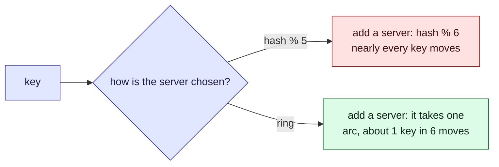

This tour is for anyone spreading data across several servers. After it, you will know how to
add a server without moving almost every key. Parcel tracker does not split its
[parcels](/parcel-tracker/data-model.md) across servers today; this tour helps decide how. A
[quiz](#quiz) closes it.

## Who is affected

| Person | What placement means to them |
| --- | --- |
| **Amira**, a customer | Her page is fast if her key is on the server asked, slow if not |
| **Sam**, on call | Adds a cache server before a busy day, and must not make the day worse |
| **The database** | Not a person, but it answers every cache miss, and falls over first |

## Background

The simplest way to pick a server is `hash(key) % servers`: hash the key to a number, and
take the remainder. It spreads keys evenly. Its flaw: the number of servers is in the formula.

> [!definition] Consistent hashing
> Place servers and keys on the same circle, by hash. A key belongs to the next server
> clockwise. A new server only takes over the stretch just before it.

> [!definition] Virtual node
> One server placed at many points on the circle. Many small stretches add up to about a fair
> share.

## The problem, one step at a time

Say the status cache runs on five servers, using `hash(key) % 5`.

1. **Amira opens her parcel.** Her key's remainder picks a server, and she gets a hit.
2. **Sam adds a sixth server.** The formula becomes `hash(key) % 6`.
3. **Amira refreshes.** Same hash, but a new remainder, so a different server. It has never
   seen her key: a miss.
4. **Almost every key has moved.** The cache is in effect empty, and the database takes the
   whole load just as *Sam* meant to add room.
5. **On a ring, only the new server's stretch moves.** On average, one key in six. *Amira* misses
   only if hers is one of them.

## The picture

With modulo, a new divisor changes nearly every remainder.



Try it, in three steps. The circle is coloured by server. The bars show how many keys each
server holds.

1. **One point each.** Open on **One point per server**. The busiest server holds about 2.3
   times the average. Read the "keys moved" lines: about 5% on the ring, about 90% with
   `hash % servers`.
2. **Evening it out.** Click **128 virtual nodes each**. The busiest server drops to about 1.2
   times the average.
3. **A bigger cluster.** Click **Twenty servers**. Adding one more moves about 4% of keys on
   the ring, and about 95% with modulo.

```widget
consistent-hash
```

> [!tip] What to notice
> In a cache, every moved key is a miss. So with `hash % servers`, adding one server nearly
> empties the cache.

## Details

> [!important] The rule
> A key's server should depend on which servers exist, not on how many there are.

> [!warning] One point per server is uneven
> Points fall unevenly on a circle, so one server can own several times its share. Virtual
> nodes even this out, at the cost of a bigger ring to store and search.

> [!edge-case] Removing a server
> Its keys move to the next server clockwise, which can overload that one neighbour. With many
> virtual nodes, they spread over many neighbours.

## Quiz

Three questions on the ideas above.

```quiz
A cache cluster uses hash(key) % 5 and a sixth server is added. What happens to the cached entries?
- [ ] About a sixth of them are now on a different server
~ That is how a ring behaves, not modulo.
- [x] Most of them are now on a different server, so most lookups miss
~ When the divisor changes, almost every remainder changes.
- [ ] None, the hash is stable
~ The hash is stable; the remainder is not.
---
Why do consistent hashing implementations give each server many points on the ring?
- [ ] To make lookups faster
~ More points make the ring bigger and the search slightly slower.
- [x] To even out how much of the ring each server owns
~ With one point each, some servers get much bigger stretches than others.
- [ ] To make keys move more often
~ The aim is the opposite: fewer moves, spread evenly.
---
A server joins a hash ring. Which keys can move?
- [ ] Any key, as with modulo hashing
~ That is what the ring is designed to avoid.
- [x] Only keys the new server now owns: none move between existing servers
~ The test suite checks this: a moved key always lands on the newcomer.
- [ ] Only the keys with the largest hash values
~ Position on the ring decides, and only the new server's stretches change owner.
```
