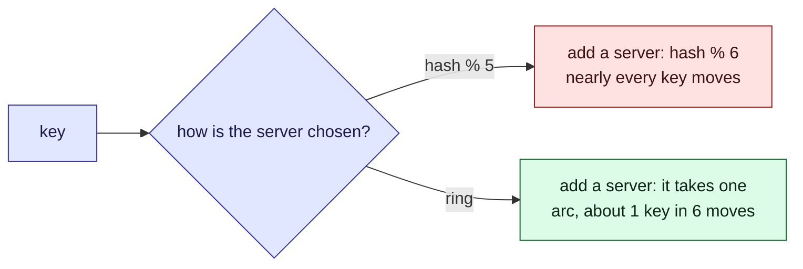

This tour is for anyone spreading data across several servers. If Parcel tracker ever shards
its [parcels](/parcel-tracker/data-model.md) or its status cache across machines, each key must
map to one of them, and adding a machine must not make every key move. It does not shard today;
this tour is for deciding how. There is a widget in the middle and a [quiz](#quiz) at the end.

## Background

The simplest placement is `hash(key) % servers`. It balances well and is stateless, and it has
one large flaw: the number of servers is in the formula.

> [!definition] Consistent hashing
> Hash both servers and keys onto the same circle. A key belongs to the first server found
> going clockwise from it. Adding a server only takes over the arc just before it.

> [!definition] Virtual node
> One server placed at many points on the circle. Its share is the total of many small arcs,
> which averages out to its fair share.

## Intuition

With modulo, a changed divisor changes nearly every remainder.



Try it. Start with **One point per server** and look at the bars. Click **128 virtual nodes
each**. Then click **Twenty servers** and read the two "keys moved" lines.

```widget
consistent-hash
```

> [!tip] What to notice
> The two "keys moved" lines are the point. In a cache, every moved key is a miss, so
> `hash % servers` turns adding one server into emptying the cache.

## Details

> [!important] The rule
> Placement should depend on the keys and the servers that exist, not on how many servers
> there are.

> [!warning] One point per server is uneven
> Points on a circle fall unevenly, so a server can own several times its share. Virtual nodes
> fix the average, at the price of a larger ring to hold and search.

> [!edge-case] Removing a server
> The keys it held move to the next servers clockwise, which can overload one neighbour. Many
> virtual nodes spread them across many neighbours instead.

## Quiz

Three questions on the ideas above.

```quiz
A cache cluster uses hash(key) % 5 and a sixth server is added. What happens to the cached entries?
- [ ] About a sixth of them are now on a different server
~ That is the ring's behaviour, not modulo's.
- [x] Most of them are now on a different server, so most lookups miss
~ The remainder changes for almost every key when the divisor changes.
- [ ] None, the hash is stable
~ The hash is stable; the remainder is not.
---
Why do consistent hashing implementations give each server many points on the ring?
- [ ] To make lookups faster
~ More points make the ring larger and the search slightly slower.
- [x] To even out how much of the ring each server owns
~ One point per server leaves some servers with much bigger arcs than others.
- [ ] To make keys move more often
~ The aim is the opposite: fewer moves, spread evenly.
---
A server joins a hash ring. Which keys can move?
- [ ] Any key, as with modulo hashing
~ That is the modulo behaviour the ring is designed to avoid.
- [x] Only keys the new server now owns: none move between existing servers
~ The test suite checks this: a moved key always lands on the newcomer.
- [ ] Only the keys with the largest hash values
~ Position on the ring, not size, decides, and only the new arcs change owner.
```
