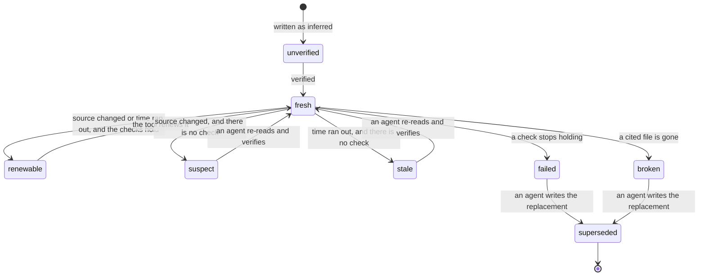
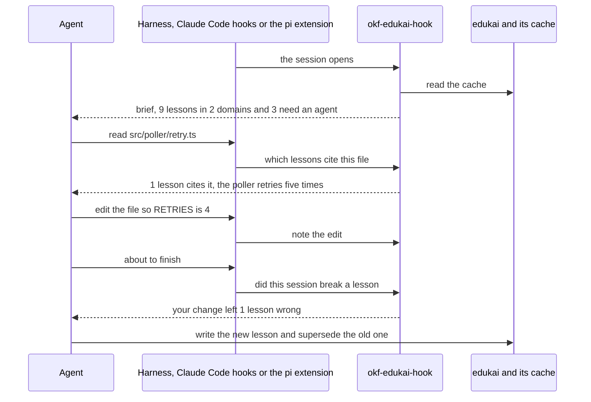

This tour is for anyone who works beside a coding agent, or reviews what one wrote. After it,
you will know what a lesson is, how its state is worked out, and what an agent is told and
when. There is no widget here: the demo runs from the command line, in four steps below. A
[quiz](#quiz) closes it. The decision behind it is
[ADR-0004](/adr/0004-agent-memory-in-a-second-bundle.md).

## Who is affected

The [cast](/parcel-tracker/overview.md#who-is-involved) meets the same problem from three
seats.

| Person | What they see when an agent's memory is wrong |
| --- | --- |
| **Sam**, on call | An agent tells him the poller waits ten seconds for a carrier. That stopped being true last week |
| **Noor**, a front-end developer | Every new session, the agent spends ten minutes finding out how the tests run |
| **Dana**, at the carrier | Traffic tuned to a timeout that no longer exists |

## Background

An agent starts each session knowing nothing about the project. What it worked out yesterday
is gone unless it was written down, and what was written down can go out of date without
anyone noticing.

> [!definition] Lesson
> One claim an agent learned, in one small file: the claim, how sure the agent is, and the
> files the claim rests on.

> [!definition] Memory bundle
> The folder of lessons, `edukai/`. It is an OKF bundle like the design bundle (`okf/`), but
> written by agents for agents.

> [!definition] Pin
> A short fingerprint (a digest) of a source file's contents, stored in the lesson when it is
> verified. If the file changes, the fingerprint no longer matches.

> [!definition] Check
> A test a script can re-run without a model: this file contains this text, lacks it, matches
> this pattern, or exists.

## The problem, one step at a time

1. **An agent reads the poller's settings.** It writes a lesson: "the poller times out a
   carrier call after ten seconds".
2. **A week later, someone lowers the timeout to eight seconds.** Nobody thinks of the lesson.
3. **A new session opens.** The agent finds the lesson, and believes it.
4. ***Sam* asks why polls fail so quickly.** The agent answers from memory: ten seconds. It is
   wrong, and it sounds sure.

Steps 1 and 2 will always happen. The memory bundle is built so that step 3 goes differently.

## Intuition: a lesson is one fact with a receipt

A design concept covers a topic and makes many claims. A lesson makes **one**, and keeps the
receipt: which file it came from, a fingerprint of that file, and, when the claim is literally
text in the file, a check.

```yaml
confidence: observed
sources:
  - resource: src/poller/config.ts
    digest: sha256:…
check:
  - { file: src/poller/config.ts, contains: "TIMEOUT_MS = 10_000" }
```

With a receipt, a script can tell when the fact needs another look. With a check, it can often
tell whether the fact still holds, with no model at all.

## The states of a lesson

A lesson's state is never stored. It is worked out from the files on every run, so an edit
made through the shell, which no hook sees, is still caught the next time anyone asks.



| State | Who acts |
| --- | --- |
| `fresh`, `superseded` | Nobody |
| `renewable` | The tool: every check still holds, so it re-pins and moves the date |
| `broken`, `failed`, `suspect`, `stale` | An agent: these four are the queue |
| `unverified` | An agent, when it matters |

> [!important] The rule
> Supersede, never delete. When a fact changes, the old lesson is marked deprecated and points
> at the new one. What was once believed stays readable.

## One session, either harness

The same three moments happen in Claude Code (through hooks) and in pi (through an
extension). Both call one small program, which reads a cache and never runs project code.



The agent is told titles and file paths, never a lesson's text. A lesson that is in the queue
is named with its state and the reason, such as `[failed · observed]` and the check that no
longer holds, so the agent knows to check it before relying on it. It opens the lesson itself
to read the claim and its caveats.

## Try it, in four steps

Run these from the repository root. The demo clock is fixed at 2026-10-15.

1. **The brief.** `npm run demo:edukai:brief` prints what an agent is told when a session
   opens: 9 lessons, 2 domains, and "1 failed, 1 broken, 1 stale".
2. **The queue.** `npm run demo:edukai:recheck` names the three. The timeout lesson is
   `failed`: its check looks for `TIMEOUT_MS = 10_000` and the file now says `8_000`. That is
   *Sam's* lesson, caught.
3. **Break one.** In `examples/demo/src/poller/retry.ts`, change `RETRIES = 5` to `4`. Run the
   re-check again: a fourth lesson is now `failed`. Put the file back with `git checkout`.
4. **Search.** `npm run demo:edukai:search -- search "tests"` ranks "CI runs tests via btest"
   first. The lesson it replaced is still there, below it, marked deprecated.

> [!tip] What to notice
> In step 2, "two carriers have webhooks" is not in the queue, although its file changed after
> it was pinned. Its check still holds, so it is `renewable`: no agent has to re-read it.

## Who checks the checker

> [!warning] A passing check is not a true claim
> The agent writes the lesson, its check, and its first `verified` entry. A wrong lesson with a
> matching check stays `fresh`. The check proves the text is in the file, nothing more.

> [!edge-case] One file, many facts
> A pin covers a whole file. A lesson about one function goes `suspect` when another function
> in the file changes, unless it has a check. That is why a check is worth writing.

> [!note] Where people come in
> A lesson an agent verified is "machine-confirmed". Only a person's review (`human:` in
> `verified`) reaches the top trust tier, and the search ranks it higher.

## Quiz

Three questions on the ideas above.

```quiz
A file a lesson cites changed last night, and the lesson has no check. Which state is it in?
- [ ] Wrong
~ Nothing has shown the claim is false. The file changed; the fact in it may not have.
- [ ] Stale
~ Stale is about time: the lesson is past its stale_after date. This one changed before its time ran out.
- [x] Suspect
~ The pin no longer matches and no check can vouch for the claim, so an agent must re-read the source.
---
The same file changes, but this lesson has a check, and the check still holds. What happens?
- [ ] An agent is asked to re-read the file
~ That is what a lesson without a check costs. Here a script can already tell the claim's text is still there.
- [x] The lesson is renewable, and the tool renews it without an agent
~ It re-pins the file and moves the date, signed as a process, not as an agent or a person.
- [ ] Nothing: a lesson with a check ignores changes to its file
~ The pin still stops matching. The check is what lets code deal with it.
---
An agent finds a lesson that is no longer true. What should it do?
- [ ] Edit the lesson so it says the new fact
~ Then nobody can see what was believed before, or when it changed.
- [ ] Delete the lesson
~ The history of a belief is part of the memory. A deleted lesson also cannot point at its replacement.
- [x] Write a new lesson and supersede the old one
~ The old lesson is marked deprecated and each points at the other, so a search still finds both and ranks the new one first.
```
