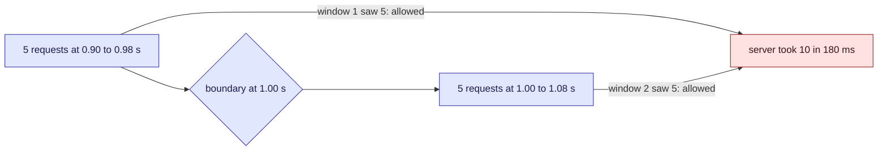

This tour is for anyone who has to protect a server, or stay under someone else's limit. The
[poller](/parcel-tracker/architecture.md) calls carriers that cap how fast it may ask, and the
[API](/parcel-tracker/api.md) could cap its own callers. Parcel tracker has no limiter written
down today; this tour is for choosing one. There is a widget in the middle and a [quiz](#quiz)
at the end.

## Background

A rate limit says "at most N requests per window". The hard part is what "per window" means,
because the three common answers disagree about bursts.

> [!definition] Fixed window
> Count requests since the last clock-aligned boundary (every second, every minute) and reset
> the count at the boundary. Cheap: one counter.

> [!definition] Sliding window
> Allow a request if fewer than N were allowed in the last window, measured back from now.
> Needs a timestamp for each recent request.

> [!definition] Token bucket
> A bucket holds up to N tokens and refills at a steady rate. Each request takes a token, and
> is refused when the bucket is empty. Two numbers of state, and it permits a burst of up to N.

## Intuition

The counter in a fixed window forgets everything at the boundary, and a client can use that.



Try it. Start with **A burst across the boundary** and read the worst-burst figure. Click
**The same burst, sliding window**. Then step through the requests with the arrows, and try
**Token bucket**.

```widget
rate-limiter
```

> [!tip] What to notice
> Same requests, same limit of five. The fixed window lets all ten through, and the worst
> burst the server saw is twice the limit. The other two keep it at five.

## Details

> [!important] The rule
> A limit is only as strong as the worst burst it allows. Measure that, not the average.

> [!warning] A shared limiter needs shared state
> The widget models one client against one process. With several servers, each keeping its own
> count, the real limit is the limit times the number of servers, unless they share a store.

> [!edge-case] A deliberate burst
> A token bucket allows a burst of up to its size after a quiet period. That is a feature when
> callers are bursty (a page load) and a hazard when the server cannot take the burst. Within
> one window it can also hand out the tokens that refill during it, so the worst burst is up to
> about twice its size: seven in a second on the widget's token-bucket preset, against a limit
> of five. Size the bucket for the burst you can accept.

## Quiz

Three questions on the ideas above.

```quiz
A fixed-window limiter allows 100 requests per minute. What is the most the server can receive in any 60-second span?
- [ ] 100, that is what the limit says
~ The limit is per clock-aligned window, not per any 60 seconds.
- [x] Up to 200, if a client sends 100 just before a boundary and 100 just after
~ Both windows saw exactly 100, so both allow it. A sliding window closes this gap.
- [ ] 50, because windows overlap
~ Fixed windows do not overlap. That is the weakness.
---
Which limiter stores the least state per client?
- [ ] The sliding window, because it only looks back one window
~ It keeps a timestamp for every allowed request in the window.
- [x] The token bucket or the fixed window: a couple of numbers each
~ A token count and a last-refill time, or a counter and a window start.
- [ ] They all store the same
~ The sliding log's state grows with the limit.
---
Your API runs on four servers, each with its own in-memory limiter set to 100 per minute. A client spreads requests evenly. What limit does it actually get?
- [ ] 100 per minute
~ Each server counts only the requests it saw.
- [x] Up to 400 per minute
~ Four independent counters, each allowing 100. Sharing the count in a store makes it 100.
- [ ] 25 per minute
~ The limit is per server, not divided between them.
```
