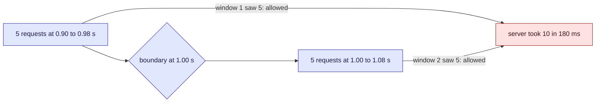

This tour is for anyone who protects a server, or must stay under someone else's limit. After
it, you will know why the simplest limiter lets through twice its limit, and what to use
instead. Parcel tracker has no limiter written down today, for the poller or the
[API](/parcel-tracker/api.md). A [quiz](#quiz) closes it.

## Who is affected

| Person | What they need from a rate limit |
| --- | --- |
| **Dana**, at the carrier | Never more than 5 requests in any second, or her API slows for everyone |
| **Sam**, on call | The [poller](/parcel-tracker/architecture.md) must stay under Dana's limit, but not go stale |
| **Amira**, a customer | Ten quick refreshes should still get an answer, not a block |

## Background

A rate limit says "at most N requests per window". The three common limiters disagree on
what "per window" means.

> [!definition] Fixed window
> Count requests since the last clock tick (each second, say), and reset at the tick. Cheap:
> one counter.

> [!definition] Sliding window
> Allow a request if fewer than N were allowed in the last window, counted back from now.
> Needs a timestamp per recent request.

> [!definition] Token bucket
> A bucket holds up to N tokens and refills at a steady rate. Each request takes a token; an
> empty bucket refuses. Two numbers of state, and it allows a burst of up to N.

## The problem, one step at a time

Dana's carrier allows five requests per second, using a fixed window.

1. **The poller sends five requests just before the second ends.** *Sam* thinks: five, fine.
2. **The clock ticks.** Dana's counter resets to zero.
3. **The poller sends five more at once.** Each window saw five, so all ten are allowed.
4. **Dana's API took ten requests in 180 ms.** Twice her limit. *Dana* sees latency climb.



No one broke the rule. The rule forgets at the tick.

## Try it, in four steps

Each tick on the track is a request. Step through with the arrows to see each decision.

1. **The problem.** Open on **A burst across the boundary**. The worst burst is ten requests
   in one second, and all ten were allowed.
2. **The fix.** Click **The same burst, sliding window**. Same requests, same limit of five.
   Step through and see where it starts refusing.
3. **Amira's burst.** Click **Token bucket: a burst, then a trickle**. The bucket starts full,
   so her first requests pass. Then it slows her to the refill rate.
4. **The cost.** Fixed window: one counter. Sliding window: a timestamp per request. Bucket:
   two numbers. A busy public API may not afford the sliding window.

```widget
rate-limiter
```

> [!tip] What to notice
> Same requests, same limit. The fixed window lets ten through in one second. The other two
> hold it to five.

## Details

> [!important] The rule
> A limit is only as strong as the worst burst it allows. Measure that, not the average.

> [!warning] A shared limiter needs shared state
> The widget models one client and one server. If several servers each keep their own count, the real limit
> is the limit times the number of servers, unless they share one store.

> [!edge-case] A deliberate burst
> After a quiet spell, a token bucket allows a burst of its full size. That suits bursty
> callers, like a page load, but not a server that cannot take it. It can also spend tokens
> that refill during the second: the widget's token-bucket preset lets seven through in one
> second, against a limit of five. Size the bucket for the burst you can take.

## Quiz

Three questions on the ideas above.

```quiz
A fixed-window limiter allows 100 requests per minute. What is the most the server can receive in any 60-second span?
- [ ] 100, that is what the limit says
~ The limit is per clock-aligned window, not per any 60 seconds.
- [x] Up to 200, if a client sends 100 just before a boundary and 100 just after
~ Each window saw exactly 100, so each allows it. A sliding window closes this gap.
- [ ] 50, because windows overlap
~ Fixed windows do not overlap. That is the weakness.
---
Which limiter stores the least state per client?
- [ ] The sliding window, because it only looks back one window
~ It keeps a timestamp for every allowed request in the window.
- [x] The token bucket or the fixed window: a couple of numbers each
~ A token count and a last-refill time, or a counter and a window start.
- [ ] They all store the same
~ The sliding window's state grows with the limit.
---
Your API runs on four servers, each with its own in-memory limiter set to 100 per minute. A client spreads requests evenly. What limit does it actually get?
- [ ] 100 per minute
~ Each server counts only the requests it saw.
- [x] Up to 400 per minute
~ Four separate counters, each allowing 100. A shared store makes it 100.
- [ ] 25 per minute
~ The limit is per server, not split between them.
```
