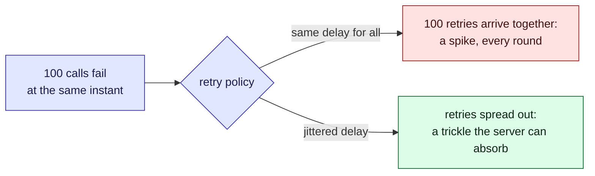

This tour is for anyone about to change how a client retries. After it, you will know why the
[retry policy](/parcel-tracker/retry-policy.md) has each setting, and what breaks without it.
A [quiz](#quiz) closes it.

## Who is affected

The [cast](/parcel-tracker/overview.md#who-is-involved) sees the same outage three ways.

| Person | What they see when a carrier's API fails |
| --- | --- |
| **Amira**, a customer | An old status, or an error, until the poller gets through |
| **Sam**, on call | Logs full of failures, and a choice whether to act |
| **Dana**, at the carrier | Her API comes back and is hit by a wall of requests at once |

## Background

Many failures fix themselves: a server restarts, the network blips. Retrying turns them into
successes. But each retry is extra load, sent just when the server is weakest.

> [!definition] Backoff
> Waiting longer before each retry. Exponential backoff doubles the wait: 0.5 s, 1 s, 2 s,
> 4 s.

> [!definition] Jitter
> A random part of each wait, so clients with the same policy do not retry at the same
> instant. "Full jitter" picks each wait at random between zero and the backoff delay.

> [!note] "Client" here
> A client is one poller worker. The hundred clients in the widget are a hundred workers,
> all calling Dana's server.

## The problem, one step at a time

1. **Dana's server restarts.** For a few seconds it answers nothing.
2. **A hundred calls fail at the same instant.** *Sam* sees a hundred errors at once.
3. **Every client plans a retry.** If each picks its own wait, the retries spread out. If all
   pick the same wait, they stay together.
4. **The server comes back.** It meets either a trickle of retries, or all hundred at once.
5. **All hundred at once can knock it over again.** The clients fail and retry together
   again. *Amira* still sees a stale status, and *Dana* has two outages instead of one.



Steps 1 to 3 happen whatever we do. The policy decides step 4.

## Try it, in four steps

Each bar is how many retries Dana's server gets in a 50 ms slice. Tall bars are bad for her.

1. **No jitter.** The widget opens on **No jitter: the thundering herd**. "Worst 50 ms" reads
   100: every client retried in the same slice. Backoff spaces the rounds, but each round is
   one spike.
2. **Full jitter.** Click **Full jitter**. The same retries spread out, and the worst slice
   drops to about a quarter.
3. **The long wait.** Click **Eight retries, no cap**. "Last retry" is about 110 s after the
   failure: nearly two minutes of silence. Switch on **Cap each delay at 2 s** and it falls to
   about 10 s. Sam trades a little more load for a client that does not look hung.
4. **Amira's wait.** Keep the cap on. Set **Retries** to 10, then 3, and watch "Last retry".
   Until a retry succeeds, Amira sees a stale status.

```widget
retry-backoff
```

> [!tip] What to notice
> Backoff spaces the rounds apart, not the clients. Without jitter, each round is still one
> spike.

> [!tip] Through each person's eyes
> **Dana** wants short bars. **Sam** wants a bounded "Last retry". **Amira** only sees whether
> her status is fresh. The policy must suit all three.

## Details

Each setting guards against one failure.

> [!important] The rule
> A retry policy must make the load on a recovering server fall over time, never rise.

> [!warning] Jitter needs room
> Jitter spreads each retry between zero and its delay. With a tiny delay there is no room to
> spread, and the early rounds still collide. That is why the base delay is 500 ms, not 50.

> [!edge-case] The last retry
> Doubling adds up fast: at a 500 ms base, the eighth wait alone is 64 s. Without the cap, a
> client can go quiet for over a minute and look hung.

## Quiz

Three questions on the ideas above.

```quiz
A hundred clients use exponential backoff with no jitter. The server fails once. What does the server see?
- [ ] A steady trickle of retries, because each wait is longer than the last
~ Longer waits space out the rounds. Within a round, every client chose the same delay.
- [x] A spike of all the clients at once, in every round
~ They all started together with the same policy, so every retry lines up.
- [ ] One spike, then nothing, because backoff stops retries
~ Backoff delays retries; it does not cancel them.
---
Why does the policy cap each wait at 2 s?
- [ ] To make the server recover faster
~ The cap makes clients retry sooner: more load, not less. It is there for the client.
- [x] To bound how long a client can go quiet before it tries again
~ Uncapped doubling reaches a minute within eight retries. The cap trades a little load for a responsive client.
- [ ] Because jitter does not work above 2 s
~ Jitter works at any delay, and better with longer ones.
---
You lower the base delay from 500 ms to 20 ms and keep full jitter. What happens to the first round?
- [ ] It spreads out even more, because there are more retries per second
~ Jitter spreads a retry across its delay. A shorter delay is a narrower window.
- [x] It bunches up again, because every retry lands in the first 20 ms
~ Full jitter only has zero to the delay to work with. A tiny delay leaves clients almost as bunched as no jitter.
- [ ] Nothing changes, because jitter is random
~ Random within a range, and the base delay sets the range.
```
