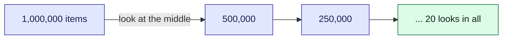

This tour is for anyone who looks something up in a list. Each parcel's tracking events are
stored [newest first](/parcel-tracker/api.md), and finding an event by time in a long history
is a search. How you search depends on whether the list is in order, and the failure when it is
not is silent. There is a widget in the middle and a [quiz](#quiz) at the end.

## Background

Linear search looks at each item in turn. Binary search looks at the middle item and, because
the list is in order, throws away the half that cannot contain the target, then repeats.

> [!definition] Precondition
> What must be true for an algorithm to be correct. Binary search's is that the list is
> sorted. If it is not, the algorithm still runs and still returns an answer; the answer is
> just not reliable.

## Intuition

Every comparison halves what is left, so the number of looks grows with the logarithm.



Try it. Drag the comparison slider through **Binary search, 64 items**, then click **Linear
search, the same list** and compare the counts. Then click **Binary search on an unsorted
list**.

```widget
binary-search
```

> [!tip] What to notice
> Binary search found 90 in 5 looks where linear search needed 46. On the unsorted list it
> reports a value that is plainly there as missing, and nothing in the output says it is
> wrong.

## Details

> [!important] The rule
> Check, or guarantee, the precondition. If you cannot be sure a list is sorted, sorting
> first costs more than a linear search for a single lookup, and pays off only over many.

> [!warning] A bug that looks like missing data
> A search that misses a present value looks like the data is not there. Before blaming the
> store, check the order the list was in when it was searched.

> [!edge-case] Small lists
> For a handful of items, linear search is as fast and has no precondition. The widget counts
> comparisons; on real hardware, memory access patterns can favour a short scan even more.

## Quiz

Three questions on the ideas above.

```quiz
About how many comparisons does binary search need for one million sorted items, at most?
- [ ] About 500,000
~ That is linear search's average, roughly half the list.
- [x] About 20
~ Each look halves the range, and a million halves to one in 20 steps.
- [ ] About 1,000
~ That would be the square root, which is not how halving works.
---
Binary search says a number is not in a list, but linear search finds it. What is the most likely cause?
- [ ] The number is in the list twice
~ Duplicates do not make a present value disappear.
- [x] The list was not sorted
~ Binary search used the order to discard the half that held the number.
- [ ] Binary search only finds even numbers
~ It finds any value, as long as the list is in order.
---
You search a list of 8 unsorted items once. Which is the better plan?
- [ ] Sort it, then binary search
~ Sorting costs more than the single linear scan it replaces.
- [x] Linear search
~ One pass is the cheapest way to search once. Sorting pays off over many lookups.
- [ ] Binary search anyway
~ It may miss a present value on an unsorted list.
```
