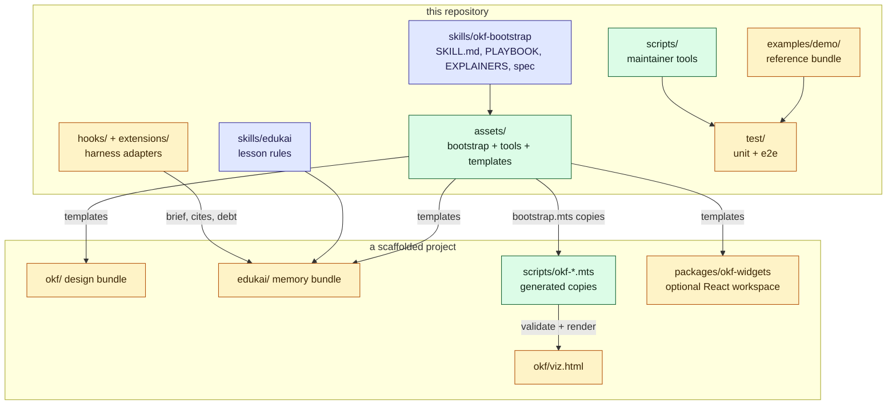

# Architecture

okf-bootstrap has three layers. Skills tell an agent what to do. Tools do the mechanical work.
Templates become the target project's own files. This repository also carries the harness
adapters and the demo, which are there to test and explain the rest.

## The layers

The diagram shows what lives in this repository and what a scaffolded project ends up with.
The arrows show how each part gets there.

## The skills

`skills/okf-bootstrap/SKILL.md` is the entry point. Its frontmatter `description` is what a
harness matches against a request, and its body is the procedure to follow. It leaves the
detail to two guides: `references/PLAYBOOK.md` (layout, frontmatter, links, gates, review
checklist) and `references/EXPLAINERS.md` (tours, quizzes, widgets). It also vendors the OKF
spec under `references/okf-spec/`, with `UPSTREAM.json` recording the upstream commit.

`skills/edukai/SKILL.md` is the memory skill. It covers what is worth a lesson, what
confidence to claim, how to re-check, and how to supersede a lesson that stopped being true.
It has no tools of its own: it uses `okf-edukai.mts` and `okf-edukai-hook.mts` from the other
skill's assets.

## The tools

`assets/bootstrap.mts` is the scaffold. It finds its templates relative to its own file, so
it can be run from anywhere with an absolute path. Given a target directory, it does four
things: it writes the bundle skeleton, copies the tools to `scripts/`, writes
`scripts/.okf-bootstrap.json`, and adds the `okf:` scripts (and, with `--edukai`, the
`edukai:` scripts) to `package.json`. A re-run keeps authored files; only `--force` replaces
them. The tools themselves are described in [the tools](/okf-bootstrap/tools.md).

## The templates

`assets/templates/` holds what a project receives:

- `okf/` and `edukai/`: the reserved `index.md` and `log.md`, and the ADR index and template.
- `concept.md` and `explainer.md`: authoring aids. They are scaffolded outside the bundle, so
  the validator does not scan them.
- `okf-widgets/`: a React workspace with ten worked example widgets, their pure models and
  their tests. With `--widgets` it becomes the project's code, and is never replaced.

## The adapters

An adapter connects a harness to the memory bundle. `hooks/hooks.json` wires the Claude Code
plugin: a SessionStart hook, a PostToolUse hook on reads and edits, and a Stop hook. Each runs
`hooks/edukai-hook.mjs`, which loads `assets/okf-edukai-hook.mts`. `extensions/edukai.ts` is
the pi adapter for the same three moments, and it resolves the same core file from the assets
folder.

Both adapters are quiet in a project with no `edukai/`, and both swallow errors, because a
hook must never get in the agent's way. The commands they run are in
[agent memory](/okf-bootstrap/agent-memory.md).

## What is not in this repository

A scaffolded project's tools are generated copies. Their source is
`skills/okf-bootstrap/assets/`, and this repository runs them from there. It deliberately
keeps no copy under `scripts/` ([ADR-0003](/adr/0003-run-the-tools-from-the-skill-assets.md)).
