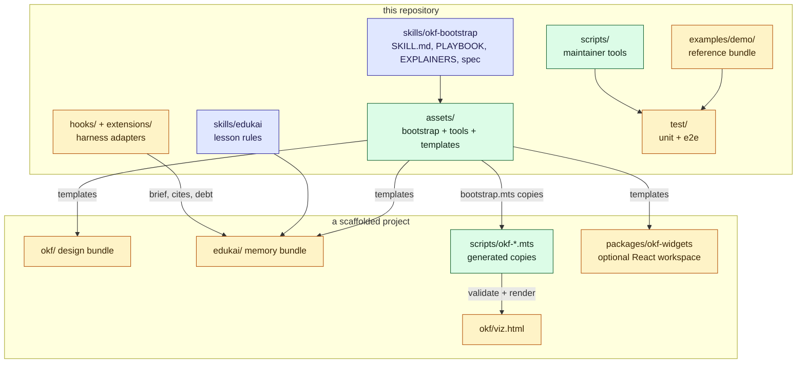

# Architecture

okf-bootstrap has three layers: skills that tell an agent what to do, tools that do the
mechanical work, and templates that become the target project's own files. This repository
also carries the harness adapters and the demo, which exist to test and explain the rest.

## The layers

## The skills

`skills/okf-bootstrap/SKILL.md` is the entry point: its frontmatter `description` is what a
harness matches against a request, and its body is the procedure. It delegates to
`references/PLAYBOOK.md` (layout, frontmatter, links, gates, review checklist) and
`references/EXPLAINERS.md` (tours, quizzes, widgets), and it vendors the OKF spec under
`references/okf-spec/` with `UPSTREAM.json` recording the upstream commit.

`skills/edukai/SKILL.md` is the memory skill: what is worth a lesson, what confidence to
claim, how to re-check, and how to supersede a lesson that stopped being true. It has no
tools of its own; it uses `okf-edukai.mts` and `okf-edukai-hook.mts` from the other skill's
assets.

## The tools

`assets/bootstrap.mts` is the scaffold. It resolves its templates relative to its own file, so
it can be run from anywhere with an absolute path. For a target directory it writes the bundle
skeleton, copies the tools to `scripts/`, writes `scripts/.okf-bootstrap.json`, and adds the
`okf:` (and, with `--edukai`, `edukai:`) scripts to `package.json`. Authored files are kept on
a re-run; only `--force` replaces them. The tools themselves are described in
[the tools](/okf-bootstrap/tools.md).

## The templates

`assets/templates/` holds what a project receives:

- `okf/` and `edukai/`: the reserved `index.md` and `log.md`, and the ADR index and template.
- `concept.md` and `explainer.md`: authoring aids, scaffolded outside the bundle so the
  validator does not scan them.
- `okf-widgets/`: a React workspace with ten worked example widgets, their pure models and
  their tests. With `--widgets` it becomes the project's code, and is never replaced.

## The adapters

`hooks/hooks.json` wires the Claude Code plugin: a SessionStart hook, a PostToolUse hook on
reads and edits, and a Stop hook, each running `hooks/edukai-hook.mjs`, which loads
`assets/okf-edukai-hook.mts`. `extensions/edukai.ts` is the pi adapter for the same three
moments, resolving the same core file from the assets folder. Both are quiet in a project with
no `edukai/`, and both swallow errors: a hook must never get in the agent's way. The commands
they run are in [agent memory](/okf-bootstrap/agent-memory.md).

## What is not in this repository

The scaffolded tools are generated copies; the canonical source is
`skills/okf-bootstrap/assets/`. This repository deliberately does not keep a copy under
`scripts/` ([ADR-0003](/adr/0003-run-the-tools-from-the-skill-assets.md)).
