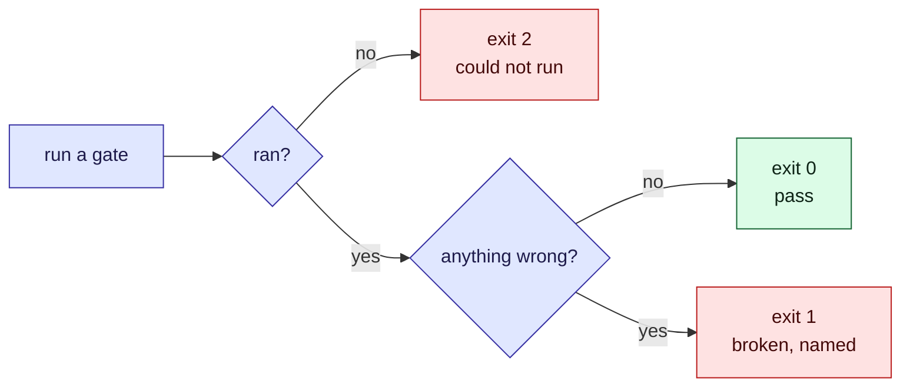

# Quality gates

A gate is a command that checks a bundle. Every gate ends in one of three ways: it passes, it
names what is broken, or it says it could not run. That third outcome is the point of the
contract. A gate that cannot run must never look like a pass.

| Exit | Means | What to do |
| --- | --- | --- |
| 0 | the check ran, and everything is fine | nothing |
| 1 | something is broken | fix it; the output names the file and line, or the file and concept |
| 2 | the gate could not run | fix the setup; **nothing is proven about the bundle** |

## The gates

| Command | Checks | Needs |
| --- | --- | --- |
| `npm run okf:validate` | Frontmatter `type`, resolvable internal links, ISO timestamps with an offset, supersede pairs, ER-diagram keys | nothing beyond the bundle |
| `npm run okf:mermaid` | Every fenced `mermaid` block parses in `mmdc`, the real Mermaid parser | `@mermaid-js/mermaid-cli` (and a browser it can start) |
| `npm run okf:mermaid:render` | Writes `viz.html`, then opens it in headless Chromium and walks every concept: diagrams settle and their pan/zoom is wired, quizzes answer, widgets mount and their probe control responds | `playwright` with Chromium, and network for the CDN |
| `npm run edukai:validate` | Lesson rules, supersede pointers, budgets, and that the syllabus in `index.md` is current | nothing beyond the bundle |
| `npm run edukai:recheck` | Reports lessons whose sources changed or went missing, or that are past `stale_after`; `-- --strict` exits 1 on broken, failed or suspect | nothing beyond the bundle |
| `npm run okf:search -- stale` | The review queue: concepts past `stale_after` | nothing; not a gate |

`npm run okf:fix` is not a gate. It rewrites the markdown so every `erDiagram` has its
generated relationship key below it. `okf:validate` fails until it has been run, and that is
the intended order: fix, then validate.

## What the gates cannot prove

A green gate proves less than it seems to. Know where each one stops.

- **The parse gate proves the parser accepts the diagram, not that it reads well.** A diagram
  can render correctly and still confuse its reader.
- **The render gate proves the page works, not that a person can follow it.** Look at
  `viz.html` in light and dark, in every view, before you trust a viewer change.
- **Validation proves the shape, not the truth.** A concept with a `type`, working links and
  correct timestamps can still say something false. The skill's rule is that every claim is
  checked against the code before it goes in, and `verified` is added only after a person has
  read it.
- **A passing check in a lesson proves the text is there, not that the claim is right.** Write
  a check for the fact, never to keep a lesson green.

## How this repository runs them

CI has three jobs:

- **`check`** (Node 24 and 26) runs `npm run check`: the typecheck, the unit tests, the
  Chromium view tests (which skip when no browser is installed), then `okf:validate` and
  `edukai:validate` on this repository's own bundles.
- **`render`** installs Chromium and runs the diagram and view end-to-end tests, then both
  Mermaid gates (`okf:mermaid` and `okf:mermaid:render`) on this repository's own bundle.
- **`spec`** runs `npm run spec -- status` weekly and fails when the vendored OKF spec has
  moved upstream.

The render job needs network for the CDN, which its end-to-end tests already use. On a machine
with no network, run the parse gate, and read the render gate's exit 2 as unproven. See
[testing and CI](/okf-bootstrap/testing.md).
