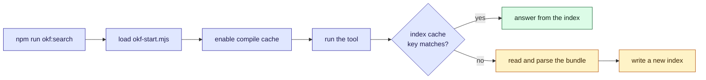

This tour is for anyone who runs the tools, or who has wondered why the npm scripts load a
file before the tool. By the end you will know what the two caches are, what each is keyed on,
and why neither ever has to decide what to throw away. There is a widget to play with, and a
[quiz](#quiz) at the end.

## Who is affected

| Person | What a slow start means to them |
| --- | --- |
| **A maintainer** | Runs `npm run check` and the gates many times a day; a second saved per run adds up |
| **An agent** | Runs `edukai:brief` and a search on nearly every session, and pays whatever they cost before it can work |
| **A hook** | Runs on session start, on every read and edit, and on finish, each with a five-second timeout |

## Background

> [!definition] Compile cache
> Node strips the TypeScript from a file before running it. It throws the stripped result away
> when the process exits, so the next run strips the same file again. Node's compile cache
> keeps that stripped code on disk, keyed by the file's content, and reuses it.

The tools are TypeScript with no build step: Node 24 runs a `.mts` file directly. That is the
point of the design, but it has a price. Every start strips the types again, and for a hook
that runs on every file read, the stripping is most of the work.

The answer is a cache. In fact there are two, of different kinds.

**The compile cache** saves the stripping. It is switched on in two places:

- `okf-start.mjs` is loaded first by every npm script (`node --import ./scripts/okf-start.mjs
  scripts/okf-search.mts`). It keeps the cache under the project's own
  `node_modules/.cache/okf-compile`, or in a private folder under the temp directory when
  there is no `node_modules` to write to.
- `hooks/compile-cache.mjs` does the same for the memory hooks. It always uses a private temp
  folder (`edukai-<uid>`, mode `0700`), because a hook may run where the project cannot be
  written to.

**The index cache** saves the reading. `okf-search.mts` keeps an inverted index on disk, so a
search does not have to read and parse every file again.

## The problem, one step at a time

1. **A hook starts.** Its launcher is plain JavaScript, and it imports the TypeScript core.
   Node strips the core's types. The process exits, and the stripped code is gone.
2. **The next read starts it again.** Same file, same stripping, for a hook that is meant to
   cost almost nothing.
3. **Turn on the compile cache.** Now the stripped code is saved in a private folder and
   reused on the next start. The tool behaves exactly as before; only the start is cheaper.
4. **An upgrade cannot serve old code.** The cache is keyed by the file's content, so a
   changed tool is a cache miss and gets stripped again. No path runs stale code.
5. **A search is a different problem.** There, the cost is reading the whole bundle to answer
   one query. So the index is cached separately, keyed by each file's size, modification time
   and change time, plus a hash of the code that wrote it.
6. **If anything does not match, the file is read again.** A deleted cache costs time, never
   correctness.

## The picture

Both caches are keyed on what they were built from: the compile cache on the content of the
code, the index on each file's size and timestamps. A mismatch means "work it out again",
never "keep the older entry".



Now try it. The widget below runs the policies a general-purpose cache might use. Those caches
have limited room, so they must *choose* an entry to throw out, and the choice can be wrong.
Take it in three steps:

1. **Belady's anomaly.** Click it and read the comparison table. With FIFO, a cache with room
   for four entries does worse than one with room for three on this trace. A cache that throws
   out by age can be hurt by having more room.
2. **A scan pushes out the hot keys.** Two keys are used all the time, then a one-off scan
   reads six keys it will never use again. LRU treats each scan key as recent and drops the
   hot ones. Switch to LFU, and the scan only churns itself.
3. **What this project does instead.** Neither of our caches has this problem, because neither
   chooses what to throw out. The compile cache is keyed by the content of the file. The index
   cache is keyed by each file's size and timestamps, and by the hash of the tool that wrote
   it. A mismatch is a miss, and a miss works the answer out again. There is nothing to evict
   and no wrong answer to keep.

```widget
cache-policy
```

> [!tip] What to notice
> The two worst cases in the table both come from a policy that guesses which entry matters
> least. Our caches never guess. They answer only for an exact key, and any other key is a
> miss.

## Details

> [!important] A cache is an optimisation, never a source of truth
> Delete `node_modules/.cache/` and everything still works, only slower. For the same reason,
> a read-only checkout, or a machine where the temp folder cannot be made private, does not
> fail. It simply runs without a cache.

> [!warning] Do not cache what can be planted
> A cache holds code that Node will run, so it must live somewhere private: under the
> project's own `node_modules`, or in a folder owned by the user with no group or world
> access. A shared temp folder is never used.

> [!edge-case] A file written as the cache is written
> When a file changes at almost the same moment the cache is written, their timestamps are
> too close to say which came first. Version control tools call this the "racily clean" case.
> `okf-search.mts` applies their rule: a file modified close to when the cache was written is
> read again, not trusted.

## Quiz

Three questions on the ideas above.

```quiz
A cache with room for four entries does worse than one with room for three. What does that show?
- [ ] The trace was too short to be meaningful
~ The trace is fixed and the comparison is exact; the size change is the whole difference.
- [x] A policy that evicts by age can be hurt by extra room
~ FIFO evicts whatever arrived first, so more room changes which entry is old at the wrong moment.
- [ ] Caches should always be sized in powers of two
~ Size is not the issue; the replacement rule is.
---
Why does this project's search cache never have to choose what to evict?
- [ ] It is small enough to hold everything
~ Bundles grow; the design does not rely on smallness.
- [x] It is keyed on the files, so a changed file is simply a miss
~ The cache answers only for an exact key: each file's size, timestamps and the tool's hash.
- [ ] It evicts the least recently used entry, like LRU
~ There is no eviction at all; a mismatch means recompute.
---
The compile cache holds stripped TypeScript keyed by the file's content. A tool is upgraded. What happens?
- [ ] The old stripped code is reused, and the new tool does not take effect
~ That would be a correctness bug, and it is not how the cache is keyed.
- [x] The content no longer matches, so the file is stripped again
~ A content key makes an edit a miss; a cache can only be stale in ways its key cannot see.
- [ ] The cache is deleted and rebuilt from scratch every run
~ That would defeat the cache; only the changed file misses.
```
