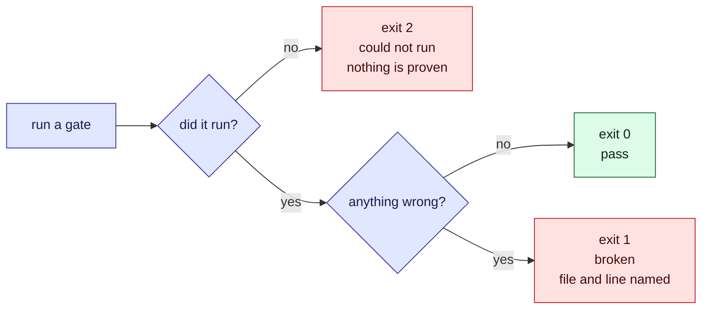

This tour is for anyone who runs a gate or reads a CI result. By the end you will know what
each exit code means, which failures are the bundle's fault and which are the machine's, and
why that difference deserves an exit code of its own. A [quiz](#quiz) closes it.

## Who is affected

| Person | What a misleading gate costs them |
| --- | --- |
| **A contributor** | A red build that is really a missing browser sends them hunting for a documentation bug that does not exist |
| **A reviewer** | A green build that never ran the check lets a broken diagram through |
| **An agent** | A tool that fails silently gives it nothing to fix, so it cannot recover |

## Background

> [!definition] Gate
> A command that checks one property of a bundle or a page and reports the result through its
> exit code. The check scripts here are gates. `okf:fix` and `okf:search` are not: they change
> or read a bundle, they do not judge it.

A check has three possible outcomes, not two. It can pass. It can find something wrong. Or it
can fail to run at all: no browser installed, no network for the CDN, no `mmdc` on the path.
The third is the dangerous one, because it looks like there is nothing to report. This project
gives it an exit code of its own, so it can never be read as a pass.

## The three outcomes



## The problem, one step at a time

1. **A diagram does not parse.** `npm run okf:mermaid` exits 1 and names the file and line.
   Fix the markdown. Nothing about the setup is in question.
2. **The browser is missing.** The same command exits 2: it could not run the parser at all.
   The diagrams are neither fine nor broken. They are unproven.
3. **A CI job reads only the exit code.** Suppose 2 were folded into 0: a runner without a
   browser would report every bundle as healthy. Suppose it were folded into 1: the runner
   would blame the author for a fault in the machine.
4. **So the code is the contract.** Every gate here shares it, and a green run always means
   the same thing: the check ran, and it found nothing.

## Details

> [!important] Read 2 as "unproven", never as "fine"
> The render gate exits 2 when `playwright`, Chromium or the CDN is missing. The parse gate
> exits 2 when `mmdc` cannot start a browser. Both print the fix. On an air-gapped runner, run
> the parse gate there and the render gate where the network is.

> [!warning] A passing gate is narrower than it looks
> Validation proves a concept has a type, working links and real timestamps. It cannot prove
> the concept is true. The parse gate proves Mermaid accepts a diagram, not that a reader can
> follow it. No gate can check a claim against the code, which is why the writing checklist
> exists.

> [!edge-case] A gate that checks its own setup
> Before it judges any diagram, `okf-mermaid.mts` renders one trivial diagram, and retries
> with `--no-sandbox` when the sandbox cannot start. That is how it tells "a bundle full of
> syntax errors" apart from "this machine cannot run a browser".

## Quiz

Three questions on the ideas above.

```quiz
A gate cannot start a browser. Which exit code should it return, and what does it mean?
- [ ] 0, because nothing was found to be wrong
~ That is the failure this contract exists to prevent: it would report every bundle healthy.
- [x] 2, meaning the check did not run and nothing is proven
~ A gate that could not run says so, and a green run always means the check actually ran.
- [ ] 1, because a missing browser breaks the build
~ 1 is for a broken bundle, named by file. Blaming the author for the machine is the other mistake.
---
Validation passes. What has it proven about a concept's claims?
- [ ] That they are true
~ It checks shape: a type, resolvable links, real timestamps.
- [x] That the concept is well formed, not that it is correct
~ Truth is checked by reading the code, which is why the writing checklist exists.
- [ ] Nothing at all
~ The shape checks are real and catch real mistakes, such as a link that silently disappeared.
---
An air-gapped runner cannot reach the CDN the viewer needs. What is the right plan?
- [ ] Treat the render gate's exit 2 as a pass
~ That is exactly the misreading the third exit code prevents.
- [x] Run the parse gate there, and the render gate where the network is
~ The parse gate can run offline; the render gate cannot, so it is run elsewhere rather than skipped.
- [ ] Remove the render gate from the project
~ It catches what the parse gate cannot, such as viewer options and dead pan/zoom controls.
```
