<!--
  An explainer is a concept whose job is understanding, not reference. It builds a mental model
  in this order: background, intuition, details, then a check. See the skill's
  references/EXPLAINERS.md for the reasoning and the rules. Delete this comment and every
  <placeholder> before committing. Keep it in okf/ (it needs its `type`), link it from
  index.md, and link out to the reference concepts instead of repeating them.
-->

One paragraph: who this is for, what they will be able to do or explain afterwards, and how
to read it (top to bottom, or jump to [the part most people come for](#details)). Mention the
interactive widgets and the [quiz](#quiz) so the reader knows they are there.

## Who is affected

Who the problem touches, one short line each. Name the cast once for the bundle and reuse it.

| Person | What they experience |
| --- | --- |
| **<Name>**, <role> | <One short line: what goes wrong or right for them> |

## Background

What the reader needs before the change or the mechanism makes sense: the existing system,
the problem, the words. Define terms once, with a callout, then use them consistently.

> [!definition] <Term>
> <One or two sentences. Say what it is, and what it is not if the two are easily confused.>

Link to the reference concepts ([Overview](/<slug>/overview.md)) rather than restating them.

## The problem, one step at a time

One incident in three to five numbered steps: one event per step, and whose view it is.

1. **<What happens, in one short sentence.>** <What *<Name>* sees.>
2. **<What happens next.>** <What *<Name>* sees.>

## Intuition

The idea in plain words and one picture, before any code. A diagram for structure, a widget
for behaviour: if the idea is "what happens when X changes", let the reader change X.

```mermaid
flowchart LR
    A["<input>"] --> B{"<the rule>"}
    B -->|"<case>"| C["<outcome>"]
    B -->|"<other case>"| D["<other outcome>"]

    classDef step fill:#e0e7ff,stroke:#3730a3,color:#1e1b4b
    class A,B,C,D step
```



Before the widget, number the steps ("Try it, in three steps"): one or two sentences each,
naming the preset to click and what to read. A widget without a prompt is a toy.

```widget
<widget-name>
```

> [!tip] What to notice
> <The one thing the widget shows that the text could only assert.>

## Details

Now the real code, in the order the reader needs it (not file order). Short excerpts, each
followed by why it is written that way. Point out the edge cases and the decisions.

> [!important] The rule
> <The invariant the rest depends on.>

> [!warning] <A trap>
> <What goes wrong, and how the code prevents it.>

> [!edge-case] <An edge case>
> <The case, what happens, and which test pins it.>

## Quiz

<N> questions on the ideas above. Pick an answer and the viewer tells you why it is right or
wrong. If you cannot pass it, re-read before building on this.

```quiz
<A question that needs the mental model, not recall of a sentence.>
- [ ] <A plausible wrong answer: a real misconception>
~ <Why it is wrong, pointing at the idea that corrects it.>
- [x] <The right answer>
~ <Why it is right, adding one fact the reader did not have.>
- [ ] <Another plausible wrong answer>
~ <Why it is wrong.>
---
<Next question.>
- [x] <Right>
~ <Why.>
- [ ] <Wrong>
~ <Why not.>
```
